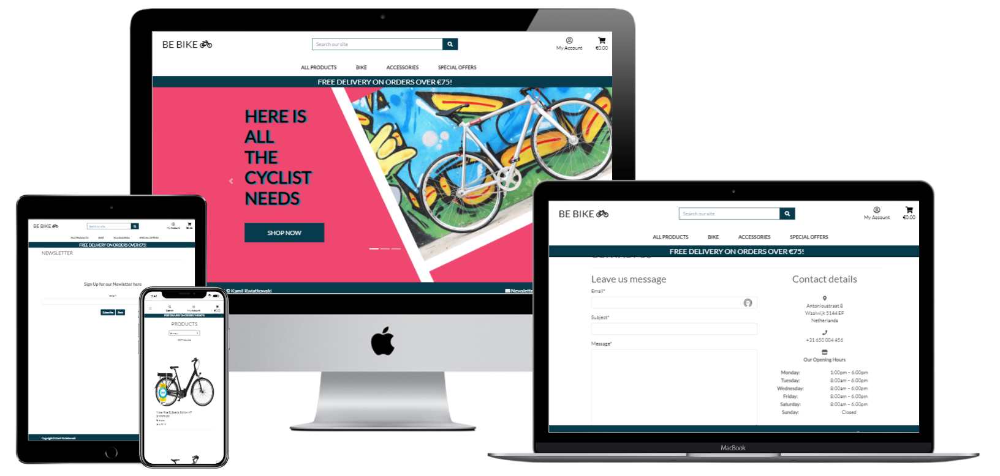

# Be Bike e-commerce store

## [See Live web](https://bebike.herokuapp.com/)

<a name="tableOfContents"></a>

# Table of Contents


[**1. Project Overview**](#overviev)
* [**1.1. Project Description**](#description)
* [**1.2 Project Requirements**](#requirements)
    * [**1.2.1 Main Technologies**](#maintech)

<hr>

[**2. UX**](#ux)
* [**2.1. Strategy**](#strategy)
    * [**2.1.1 Project Goals**](#projectGoals)
    * [**2.1.2 User Goals**](#userGoals)
    * [**2.1.3 User Expectations**](#userExpectations)
    * [**2.1.4 Trends of Modern Websites**](#trends)
* [**2.2. Structure**](#structure)
* [**2.3. Skeleton**](#skeleton)
* [**2.4. Colour Scheme**](#colourScheme)
* [**2.4. Typography**](#colorScheme)
* [**2.5. Icons**](#icons)
* [**2.5. Data Base**](#dataBase)

<hr>

[**3. Agile Methodology**](#agile)
* [**3.1. KANBAN**](#kanban)

<hr>

[**4. Existing Features**](#features)
* [**4.1. Home page**](#home)
* [**4.2. Navbar**](#navbar)
* [**4.3. Footer**](#footer)
* [**4.4. The carousel**](#carousel)
* [**4.5. User authentication**](#authentication)
* [**4.6. User profile**](#userProflie)
* [**4.7. Contact**](#contact)
* [**4.8. Newsletter**](#newsletter)
* [**4.9. Shop**](#shop)
* [**4.10. Shopping bag**](#bag)
* [**4.11. Product view**](#view)
* [**4.12. Login Page**](#loginPage)
* [**4.13. Logout Page**](#logoutPage)
* [**4.14. Checkout Page**](#checkputPage)
* [**4.15. Checkout Success Page**](#successCheckputPage)
* [**4.16. Newsletter Subscribe Page**](#subscribePage)
* [**4.17. Newsletter Subscribe Pag**](#unsubscribePage)

<hr>

[**5. Technologies Used**](#technologies)
* [**5.1. Languages Used**](#languages)
* [**5.2. Frameworks**](#frameworks)
* [**5.3. Database**](#databasesUsed)
* [**5.4. Technologies and Programs Used:**](#techPrograms)


<hr>

[**6. Testing**](#testing)
* [**6.1 Python - PEP8**](#testing)
* [**6.2 Html - W3C**](#testing)
* [**6.3 CSS - W3C**](#testing)
* [**6.4 JSHint**](#testing)
* [**6.5 Manual Testing**](#testing)
    * [**6.5.1 Home page**](#testing)
        *   Carousel
        *   Buttons caurusel
        *   Navbar
        *   Footer
        *   Home responsivenes
    * [**6.5.2 My account**](#testing)
        *   My account register
        *   My account login logout user
        *   My account login admin

    * [**6.5.3 Products**](#testing)
        *   Add products to database
        *   All products add to bag
        *   Add review
        *   Add product responsivnes
        *   Product view responsivnes
    * [**6.5.4 Checkout payment**](#testing)
    * [**6.5.5 Contact Form**](#testing)
    * [**6.5.6 Newsletter subscribe and unsubscribe**](#testing)

<hr>

[**7. Search Engine Optimalisation**](#seo)

<hr>

[**8. Marketing**](#marketing)

<hr>

[**10. Social Media Business Page**](#social)

<hr>

[**11. Deployment**](#deployment)

<hr>

[**12. End Product**](#endProduct)

<hr>

[**13. Known Bugs**](#knownBugs)
* [**13.1 Fixed bugs**](#fixedBugs)
* [**13.1 Remaining Bugs**](#remainBugs)

<hr>

[**14. Credits**](#credits)

<hr>

[**15. Acknowledgements**](#acknowledgements)

<hr>


[Back to Table Of Content](#tableOfContents)

<a name="overviev"></a>

# **1. Project Overview**

<a name="description"></a>

# **1.1. Project Description**

One of the best benefits of living in the Netherlands is having access to over 37 000 km of bicycle paths, the only thing you need to enjoy is a bike. Therefore, I have created a bike shop website, where viewers can buy a bike, as well as some basic parts and accessories.

The website allows users to use a search engine to find the most suitable product and with just one click add to the shopping trolley. The website is intuitive with a simple design, so with this e-commerce website buying a bike is as simple as ordering food delivery and who doesn’t like good home delivery.

<a name="requirements"></a>

# **1.2 Project Requirements**


# **1.2.1 Main Technologies**](#maintech)

As per project technologies scope for this project 

-   HTML, CSS, JavaScript, Python+Django

-   Relational database MySQL or Postgres

-   Stripe payments to handle payments

-   Additional libraries


<a name="ux"></a>

# **2. UX**

Be Bike website is designed in modern coloristic with white background. The coloristic gamma used was #EF476F #118AB2 #073B4C.

User can either choose from the dropdown menu the product category and scroll through the range of products or can use the search engine to find a specific item.

To make a purchase users can pay with a credit card as the checkout page features stripe payments.

User can also be engaged by reviewing the products.


<a name="projectGoals"></a>

# **2.1.1 Project Goals**

My goal was to create a simple and intuitive store, where customers can purchase bikes and bike related items. Website has a simple design, allowing user to navigate easily through it, by doing those customers can focus on the content, rather than trying to find items on the page.

<a name="userGoals"></a>

# **2.1.2 User Goals**

(#userGoals)

ITEM            | FIRST TIME USER                  | RETURNING USER
--------------- | -------------------------------- | ---------------
View a list of products and select items to purchase | ✅ | ✅	 	 
Choose Product  Category to view products and select items to purchase | ✅ | ✅ 
Search products by name via the toolbar search option | ✅ | ✅
Have visibility on price and product details | ✅ | ✅
See the total of my purchases at the time | ✅ | ✅
Sort list of products by best rated and price | ✅ | ✅ 
Sort list of products in the specific product category | ✅ | ✅
Add items to the basket and view what is currently in the basket | ✅ | ✅
Update the quantity or remove the items from the basket before checking out | ✅ | ✅	 	 
Easily enter the payment information at the checkout page | ✅ | ✅
Have a secure payment checkout | ✅ | ✅
Check out as guest | ✅ | ✅
Create an account | ✅ | ✅
Update my user profile |  | ✅ 
View order history |  | ✅
Easily log in and log out |  | ✅
Register for an account |  | ✅

<a name="userExpectations"></a>

# **2.1.3 User Expectations**

The website should have a simple user interface, with the navigation to each section clear
-	The menu is intuitive and clear to read.

-	The user can navigate easily through an interface. 

-	The website responsiveness is achieved on all devices. 

-	The user has a clear overview of all products/product groups. 

-	Before making a payment, the total purchase price is displayed, and product quantities can be removed/ adjusted. 

-	Website has a secure payment method, giving the user comfort feeling

<a name="trends"></a>

# **2.1.4 Trends of Modern Websites**

Based on the new trends in the website design, I have used the concept from the 1980s – Memphis design, which in this case was making the main page design simultaneously more colour, approachable and adventurous.  

<a name="structure"></a>

# **2.2. Structure**

Responsiveness design has been included in this project, as users are using different devices (including mobiles, laptops/ PC, and tablets). This is to ensure user achieves the best experiences on their chosen device.

-	User can easily navigate through labeled buttons 

-	All elements are consistent in font size, and color scheme. 

<a name="skeleton"></a>

# **2.3. Skeleton**

# **Wireframes**

### **Home page**
<hr>

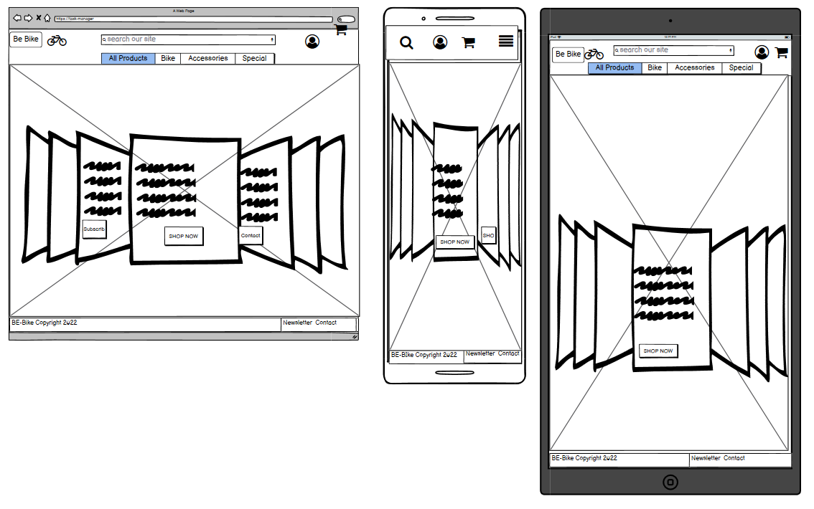

### **Sign up page**
<hr>

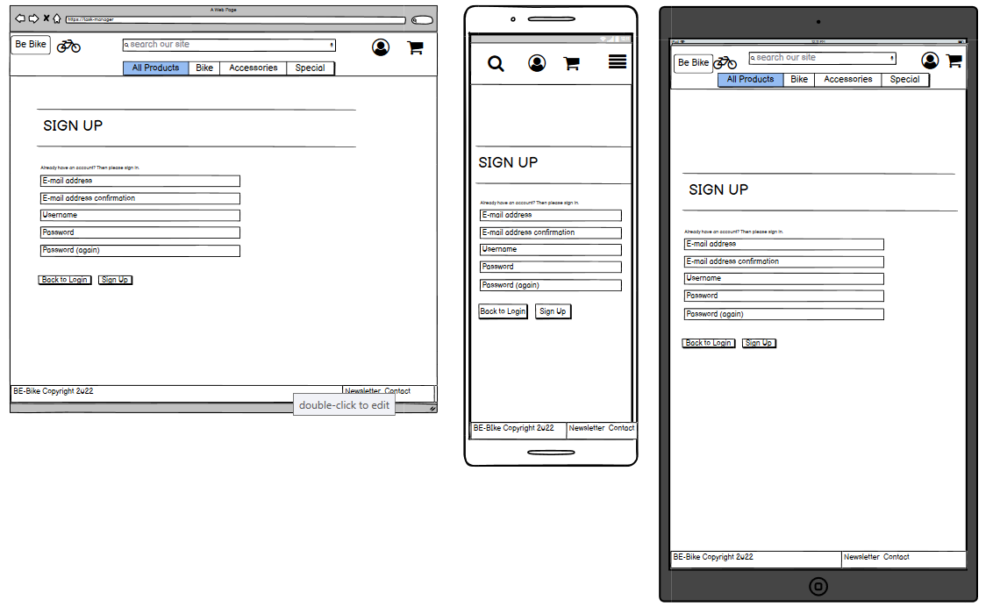

### **Sign in page**
<hr>

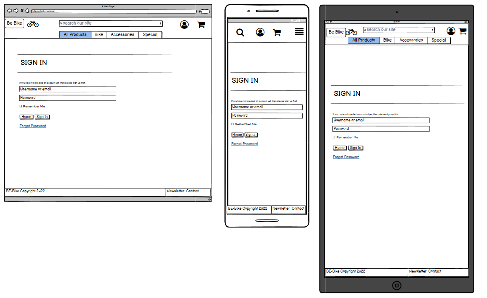


### **Contact page**
<hr>

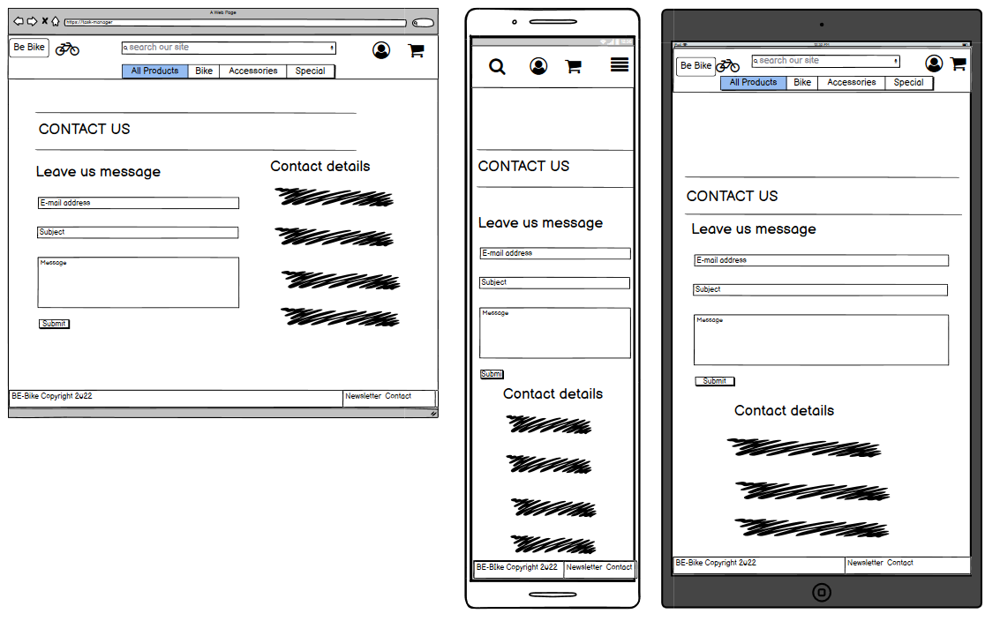

### **Newsletter**
<hr>

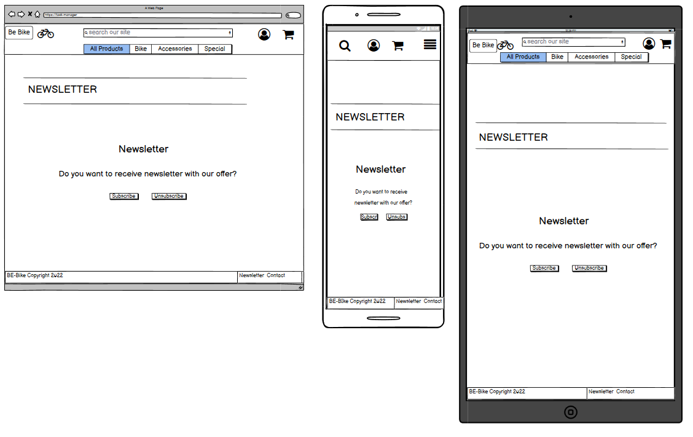

### **Newsletter Subscribe**
<hr>

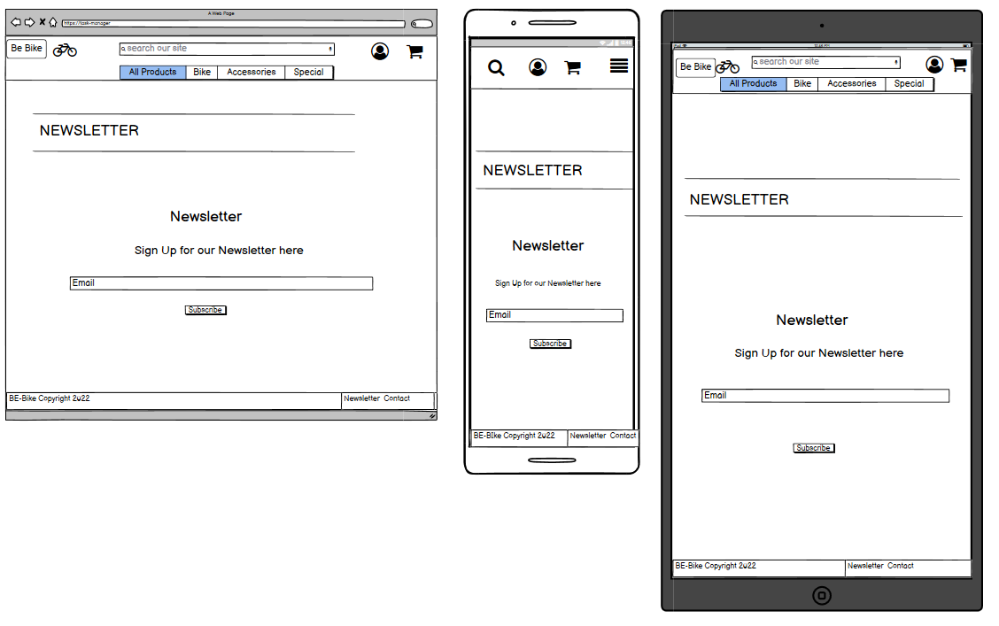
<hr>

### **Newsletter Unsubscribe**

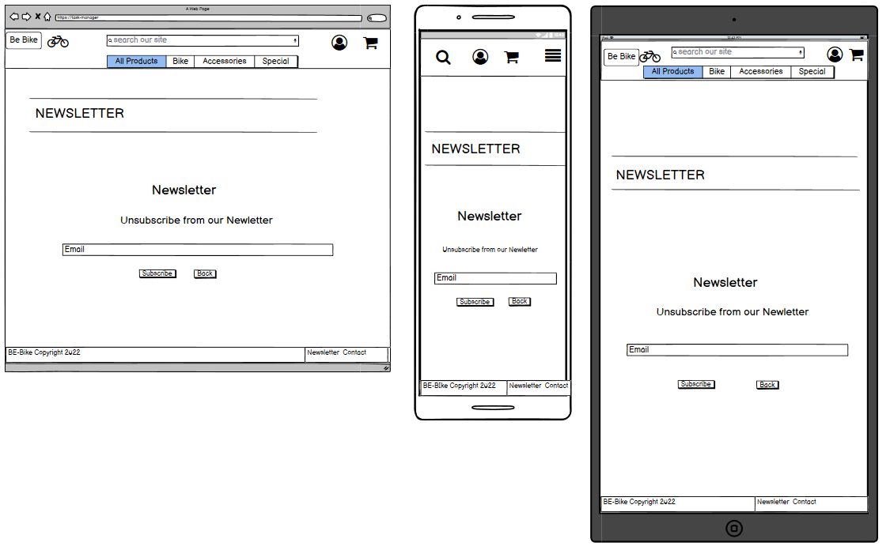
<hr>

### **Products**

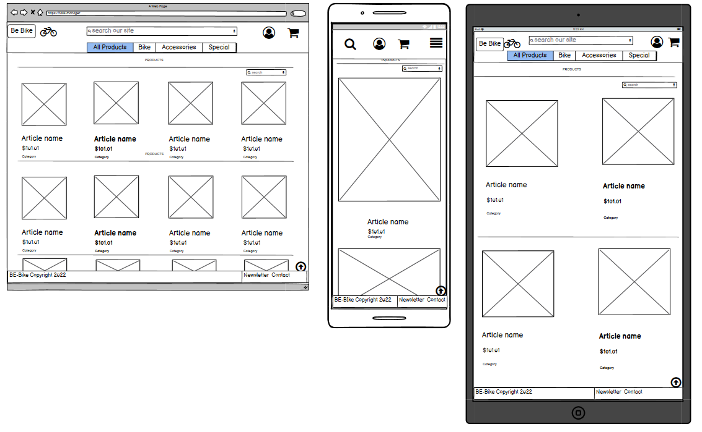
<hr>

### **Products View**

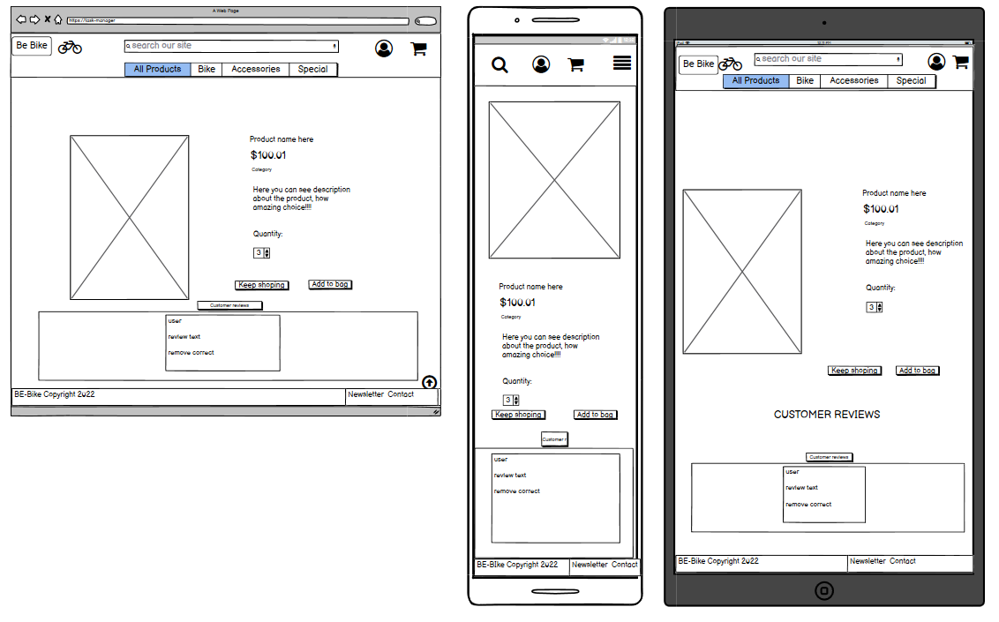
<hr>

### **Shopping bag**

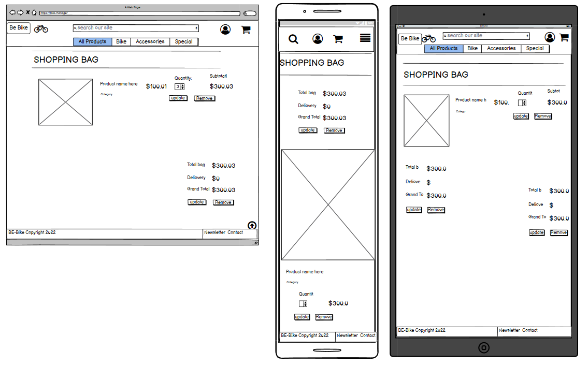
<hr>

<a name="colourScheme"></a>

# **2.4. Colour Scheme**

Colors

Please find the colours schemes that I used colors #EF476F #118AB2 #073B4C

### **Colour gamma**

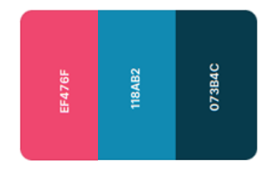
<hr>

<a name="typography"></a>

# **2.5. Typography**

I decided to use "Lato" as my font of choice with sans serif as my backup font for browsers that might not support "Lato".

The link to the font can be found [Google Fonts](https://fonts.google.com/)

<a name="icons"></a>

# **2.6. Icons** (#icons)

I use icons provided by [Font Awesome](https://fontawesome.com/)


### **My account - user-circle-o**


<hr>

### **Bag shopping-cart**

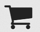
<hr>

### **Newsletter envelope**

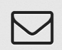
<hr>

### **Contact comments-o**


<hr>


[Back to Table Of Content](#tableOfContents)

<a name="agile"></a>

# **3. Agile Methodology**
Github issues were used to create the User stories and group them according to the MoSCoW prioritization technique. Link to the project with live issues can be found  [here](https://github.com/kamil-kw/BeBike/projects/1)

The issues were then closed automatically when the pull request was linked to the issue.

<a name="kanban"></a>

# **3.1. KANBAN**

### **Kanban Initial**
<hr>

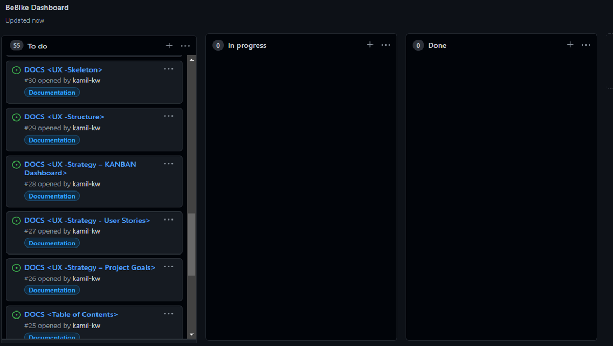

### **Kanban Mid process**
<hr>

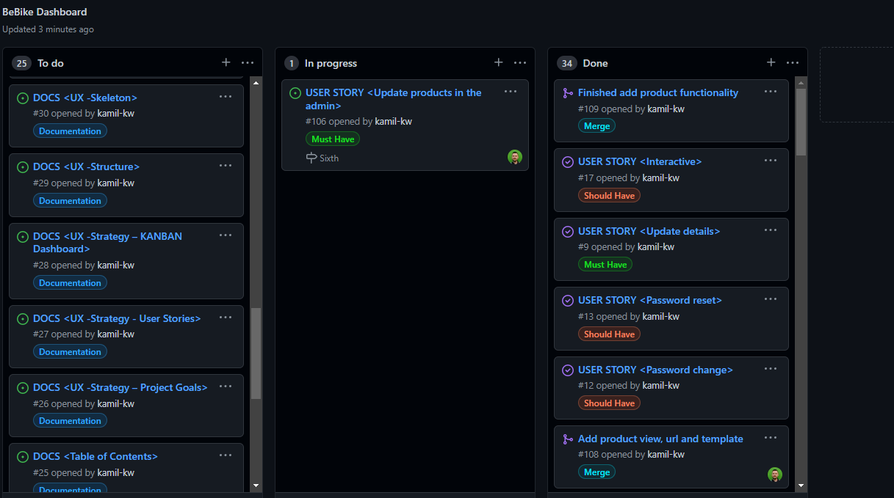

### **Kanban Final**
<hr>


[Back to Table Of Content](#tableOfContents)

<a name="features"></a>

# **4. Existing Features**

-	Responsive design

-	Navigation Menu

-	Postgress databases to store information and user login/profile information

-	CRUD Functionality

-	Filter list details functionality

-	Login functionality

-	Logout functionality

-	Register functionality

<a name="home"></a>

# **4.1. Home page**

-	A carousel that displays contact, newsletter subscription and shop now options.

-	A shop now button that directs the user to the “All products” page where user can easily identify products they would like to purchase.

-	A contact button that directs the user to the contact form where they can contact the customer service team. 

<a name="navbar"></a>

# **4.2. Navbar**

-	Store name with link to home page.

-	Products search bar.

-	My account dropdown list will display different elements dependent if user is a registered user or a guest.

-	Products are categorised to enable easy finding of the items; the icons are automatically adjusting depending on the screen size.

<a name="footer"></a>

# **4.3. Footer**

-	Copy rights.

-	Contact link to access page where user can contact customer service team.

-	Newsletter link to access page where user can subscribe or unsubscribe to receive “special offer”

<a name="carousel"></a>

# **4.4. The carousel**

-	A carousel that displays contact newsletter and shop now options.

-	Shop now slides with message and button to product page.

-	Contact slide with message and button to contact page.

-	Newsletter slide with message and button to newsletter page.

<a name="uthentication"></a>

# **4.5. User authentication**

-	New users can register in my account page.

-	Existing users can log in to their account page.

<a name="userProflie"></a>

# **4.6. User profile**

-	This page shows a form so the user can update their delivery details. Upon completing the form, all delivery details will be automatically updated if the user proceeds to the checkout page again.

-	User can view order history by selecting the order number, if order is completed user would receive an error message indicating they are viewing a past order summary

<a name="contact"></a>

# **4.7. Contact**

-	Where user can leave message to customer service using site form.

-	Form check if email include @ sign, to ensure customer service can return to user.

-	Contact details - if user want to visit store or use different form of contact.

<a name="newsletter"></a>

# **4.8. Newsletter**

-	User can choose to subscribe or unsubscribe, this will direct to the correct page to newsletter.

<a name="shop"></a>

# **4.9. Shop**

-	The user can access the product pages by selecting the product category from the navigation bar.

-	 Filter using sort bar at the top right of the page,  user can filter by price, rating, name and category.

-	Each product has an image, name of product, price, category and rating.

-	The page also contains a back to top button, which the user can click to go to the top of the page.

-	As a superuser, the admin can see the edit and delete buttons, allowing quick access to the product admin

<a name="bag"></a>

# **4.10. Shopping bag**

-	This page shows each product as a line item, displaying an image, name of the product, size, SKU, price per item, the quantity selected, quantity selector to update and a subtotal for each item.

-	When the quantity selector is at 1, the minus button is disabled, user can use the button underneath (remove) to remove item from the basket. 

-	Basket would show the pricing summary of all items within, delivery fee and total.

-	If the user has not met the free delivery threshold, then an alert message is shown, prompting the user that they can qualify for free delivery if they spend more.

<a name="view"></a>

# **4.11. Product view**

-	The product details will highlight an image, name of the product, brief description, price, category and rating, quantity selector, keep shopping button and an add to basket button.

-	Admin (superuser) have ability to edit and delete buttons, allowing quick access to the product admin .

-	The quantity selector starts at 1. When the quantity is at 1, the minus button is disabled.

-	When adding a product to the basket, the user will be prompted with a success message confirming the product has been added.

<a name="loginPage"></a>

# **4.12. Login Page**

-	Registered user would need to enter the email address and password that they used when signing up to the site.

-	The user can only log in once they have activated their account via an email received after signing up.

-	A message to prompt the user that if an account has not been created, they can click the signup hyperlink to be redirected to the signup page.

-	If the user enters in the wrong credentials, an error message is displayed to the user.

-	Once the user has successfully logged in, they will be redirected to the home page. A success message will show to confirm the login has been successful.

<a name="logoutPage"></a>

# **4.13. Logout Page**

-	When clicking logout from the navigation bar, the user is redirected to a sign-out page to confirm their action.

<a name="checkputPage"></a>

# **4.14. Checkout Page**

-	A checkout form, prompts the user to enter their delivery details with Stripe integration.

-	User has ability to save their details for next time, this is enabled by having a checkbox, which user can confirm. This would save the delivery detail and not the card details. 

-	Before continuing with checkout process, order summary will be displayed for user to validate the total purchase summary and see all items.

-	A message is shown just below the complete order button to warn the user that they will be charged a certain amount on their card.

<a name="successCheckputPage"></a>

# **4.15. Checkout Success Page**

-	This page shows a summary of their order, with an order number.

-	Once the user is on this page, an email will also be triggered to send out an order confirmation email.

<a name="subscribePage"></a>

# **4.16. Newsletter Subscribe Page**

-	User can subscribe to the newsletter by using a one-field form.

-	Once the user has successfully subscribed to the newsletter, they will be redirected to the home page. A success message will show up confirming the user has successfully subscribed to the newsletter.

-	If the user has already subscribed, an error message will show up.

<a name="unsubscribePage"></a>

# **4.17. Newsletter Subscribe Page**

-	User has ability to unsubscribe by filling email into the form displayed at the website.

-	Once the user has successfully unsubscribed from the newsletter, they will be redirected to the home page. A success message will show up confirming the user has successfully unsubscribed to the newsletter.

-	If the user enters an email address that is not subscribed to the newsletter, a message will be displayed to the user.

<a name="technologies"></a>

# **5. Technologies Used**

<a name="languages"></a>

# **5.1. Languages Used**

-   [HTML5](https://en.wikipedia.org/wiki/HTML)
    -   The project uses HyperText Markup Language.
-   [CSS3](https://en.wikipedia.org/wiki/CSS)
    -   The project uses Cascading Style Sheets.
-   [JavaScript](https://en.wikipedia.org/wiki/JavaScript)
    -   The project uses JavaScript.
-   [Python](https://en.wikipedia.org/wiki/Python_(programming_language))
    -   The project uses Python.
    -   asgiref==3.5.1
    -   backports.zoneinfo==0.2.1
    -   boto3==1.23.9
    -   botocore==1.26.9
    -   dj-database-url==0.5.0
    -   Django==3.2
    -   django-allauth==0.41.0
    -   django-countries==7.2.1
    -   django-crispy-forms==1.14.0
    -   django-formtools==2.3
    -   django-storages==1.12.3
    -   gunicorn==20.1.0
    -   jmespath==1.0.0
    -   oauthlib==3.2.0
    -   Pillow==9.1.0
    -   psycopg2-binary==2.9.3
    -   python3-openid==3.2.0
    -   pytz==2022.1
    -   requests-oauthlib==1.3.1
    -   s3transfer==0.5.2
    -   sqlparse==0.4.2
    -   stripe==2.72.0
-   [Jinja](https://jinja.palletsprojects.com/en/3.0.x/templates/)
    -   Templating language for html

<a name="frameworks"></a>

# **5.2. Frameworks Libraries**
-   [Django](https://www.djangoproject.com/)
    -   The project uses Django as the main framework.
-   [Boostrap 4](https://getbootstrap.com/docs/4.0/getting-started/introduction/)
    -   Bootstrap Grid was used for responsiveness as well as features such as accordion.
-   [jQuery 3.6](https://blog.jquery.com/)


<a name="databasesUsed"></a>

# **5.3. Database**

-   [Sqlite](https://www.sqlite.org/index.html)
    -   The project uses sqlite as a local enviromental database
-   [PostgreSQL](https://www.postgresql.org/)
    -   The project uses PostgreSQL as a deployment database

<a name="techPrograms"></a>

# **5.4. Technologies and Programs Used:**

-   [AWS](https://aws.amazon.com/)
    -   The project uses Amazon Web Services to host all static and media files.
-   [Heroku](https://www.heroku.com/)
    -   The project is deployed and hosted by Heroku.
-   [Balsamiq](https://balsamiq.com/)
    -   Balsamiq was used to create the wireframes during the design process.
-   [Google Fonts](https://fonts.google.com/)
    -   Google fonts were used to import the "Lato" font into the style.css file which is used on all pages throughout the project.
-   [GitHub](https://github.com/)
    -   GitHub was used to store the project's code after being pushed from Git
-   [Gitpod](https://www.gitpod.io/)
    -   The project uses Gitpod.
-   [Chrome](https://www.google.com/intl/en_uk/chrome/)
    -   The project uses Chrome to debug and test the source code using HTML5.
-   [W3School](https://www.w3schools.com/)
    - For problem solving and code searching
-   [Stack Overflow](https://stackoverflow.com/)
    - For problem solving and code searching
-   [PEP8 validator](http://pep8online.com/)
    - For checking python convention
-   [Font Awesome](https://fontawesome.com/)
    - Special Icons for links
-   [Multi Device Website Mockup Generator](https://techsini.com/multi-mockup/index.php)
    - Multi Device Website Mockup Generator was used to create the Mock up image in this readme
-   [Django Secret Key Generator](https://miniwebtool.com/django-secret-key-generator/)
    - Use to generate unique key
-   [TinyPNG](https://tinypng.com/)
    - REsize image to imporove loading time
-   [Stripe](https://stripe.com/ie)
    - Online payment system.
-   [AWS-S3 Amazon](https://stripe.com/ie)
    - Online payment system.


<a name="testing"></a>

# **6. Testing**

All test [here](READMETEST.md) in the test file

<a name="seo"></a>

# **7. Search Engine Optimalisation**
To improve the search engine optimisation (SEO) of the site I:

- Added keywords in a meta tag to my base.html. The keywords were researched using  [WordTracker](https://www.wordtracker.com/), there are a number of short-tail and long-tail keywords for territory of Netherlands.

- This is a list of all the keywords I produced:
    - short tail words - bike, bicycle, ebike, city bike
    - long tail words - bike shop near me, electric bike, mountain bike, transport bike

- I ended up using these:

Word Bike

Key Word             | 
-------------------- | 
bike shop near me | 
bike shop | 
mountain bike | 
bike | 
bicycling | 
bike |
e bike |
bicycle shop |
electric bicycle |
cycle |
e bikes for sale |


I choose these keywords because they didn't have incredibly high volume and competition.

<hr>

<a name="marketing"></a>

# **8. Marketing**

As part of my marketing strategies, I have decided to use content marketing, social media and email marketing root. All options are free, but effective for an e-commerce store.

-	Social media – Facebook was the chosen platform, which will help with building relationships and loyalty with customers. This will be enabled by frequent updates to the site, promoting the items and having direct interactions with existing and potential customers. The next steps would include usage of YouTube & Instagram as social media platforms. 


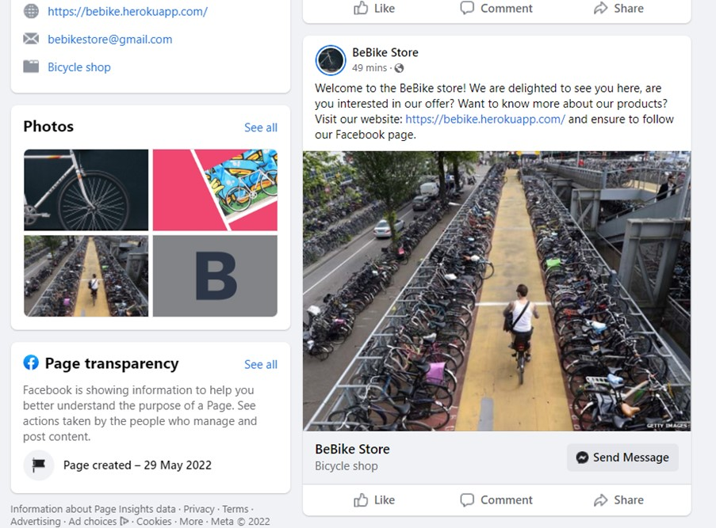


-	Email marketing – another free source of marketing, where by using email subscriptions users would receive a newsletter, outlining current items in the store, sales and any other elements. This is a straightforward way to increase sales and have customer returning by providing discounts
<hr>

<a name="social"></a>

# **9. Social Media Business Page**

The business will use social media as a platform to promote the business is [Facebook business page](https://www.facebook.com/BeBike-Store-100847359323133)


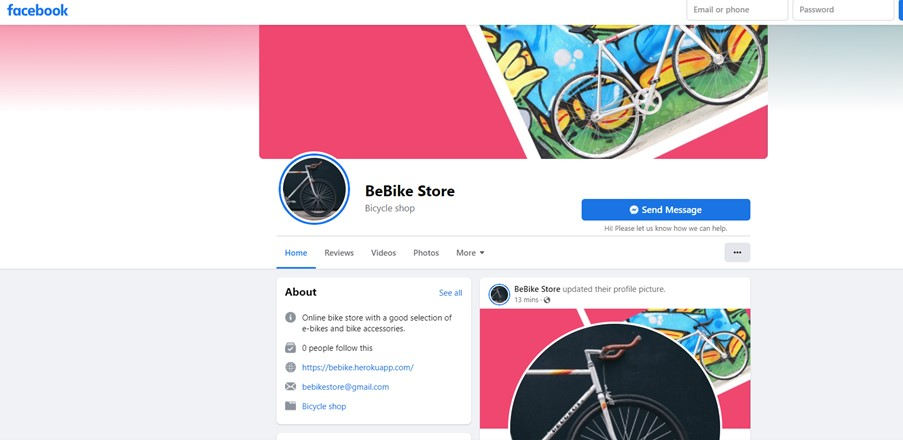

<a name="deployment"></a>

# **10. Deployment**

### **Development Environment**
<hr>

1. Create requirements.txt pip3 freeze --local > requirements.txt
2. Create Procfile.
3. Commit and push changes to Github.
4. Move to the Heroku part of a deployment.

### **To deploy my final project to the cloud I used Heroku. To do this I had to**
<hr>

1. Push the latest code to GitHub.
2. Go to Heroku
3. Select new in the top right corner.
4. Create a new app.
5. Enter the app name and select Europe as the region.
6. Connect to GitHub.
7. Search for repo-name.
8. Select connect to the relevant repo you want to deploy.
9. Select the settings tab.
10. Add buildpack
11. Select Python, then save changes.
12. Make sure Heroku/Python is at the top of the list, followed by Heroku/Nodejs
13. Navigate to the deploy tab
14. Scroll down to Manual Deploy and select deploy branch.

### **AWS S3 Bucket Configuration**
1. Add and configure the AWS S3 Bucket:bebike, All public access. ACL: Everyone Objects -> List.
2. Create the Bucket Policy - bebike policy.
3. Create the Cross-Origin Resource Sharing (CORS)
4. Access AWS IAM and create a user for the Training Project. Create a group, with the user attached. Download the CSV file with the credentials and save it in a safe place. Updated the ‘.env’ file with the relevant variables.
5. Execute python3 manage.py collectstatic to upload static files to the AWS S3 Bucket.
6. Upload the ‘media’ folder and files manually.
7. Remove DISABLE_COLLECTSTATIC variable from Heroku Config Vars.

### **Heroku Postgres Database**
<hr>

1. Go to the Resources tab in Heroku.
2. Select Heroku Postgres from the Add-ons search bar
3. Choose the Hobby Dev-Free plan.
4. Click submit the order form.
5. Go back to Gitpod bash terminal and install
    * pip3 install dj_databse_url
    * pip3 install psycopg2-binary 
6. Seve in the requirements file by: 
    * pip3 freeze > requirements.txt
<hr>

<a name="endProduct"></a>

# **11. End Product**

### **Home page**

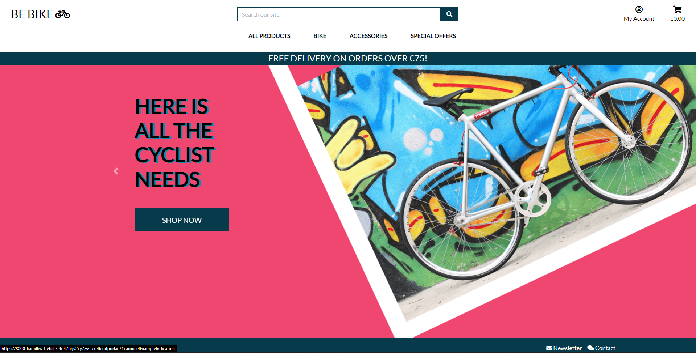


### **Product page**

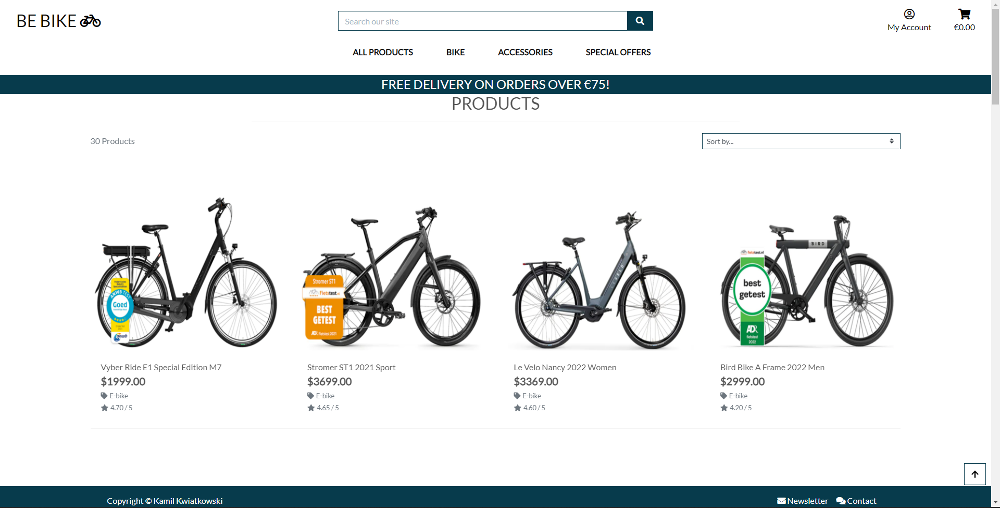

### **Product view**

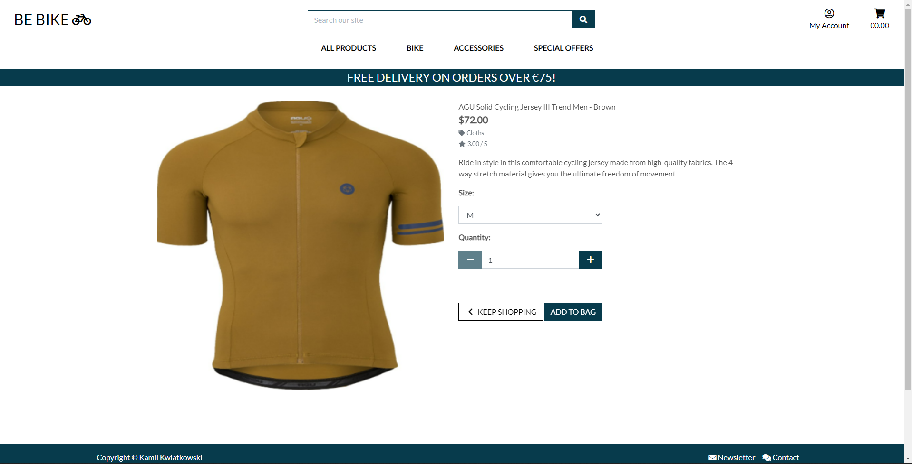

### **Sign in**

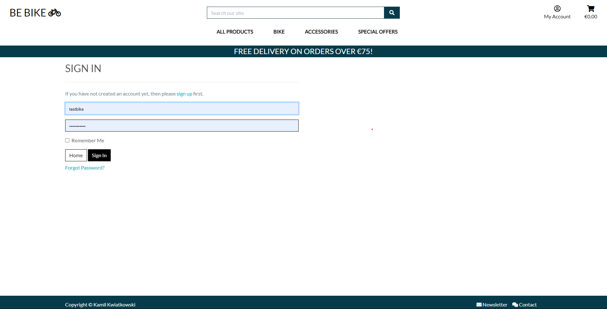

### **Sign out**

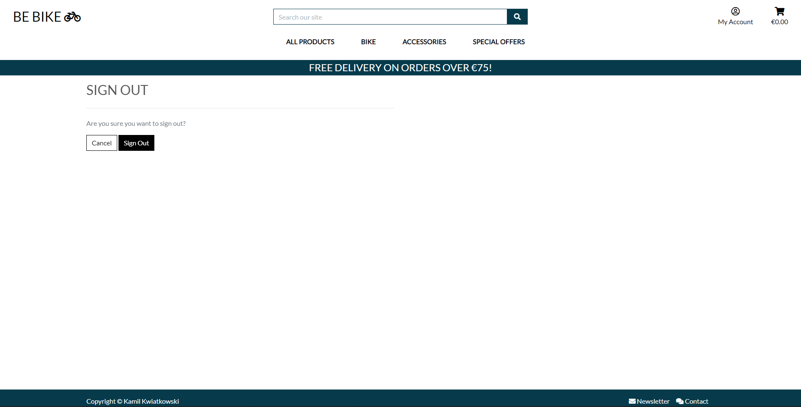

### **My Profile**

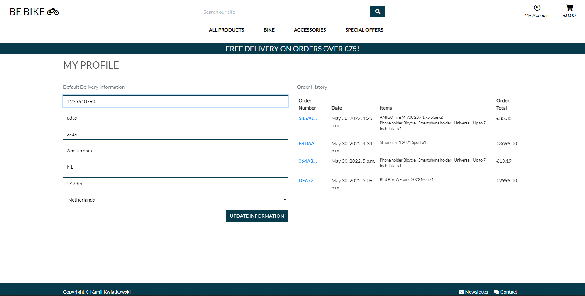

### **Newsletter**

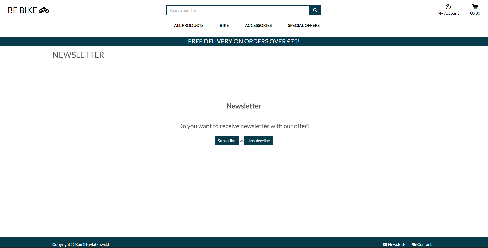

### **Newsletter subscribe**


### **Newsletter unsubscribe**

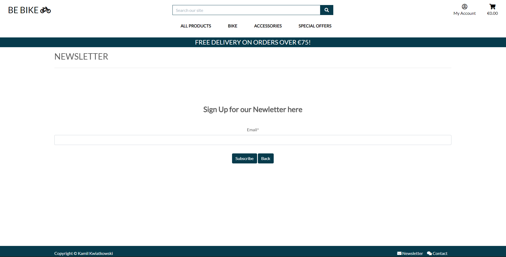

### **Checkout page**

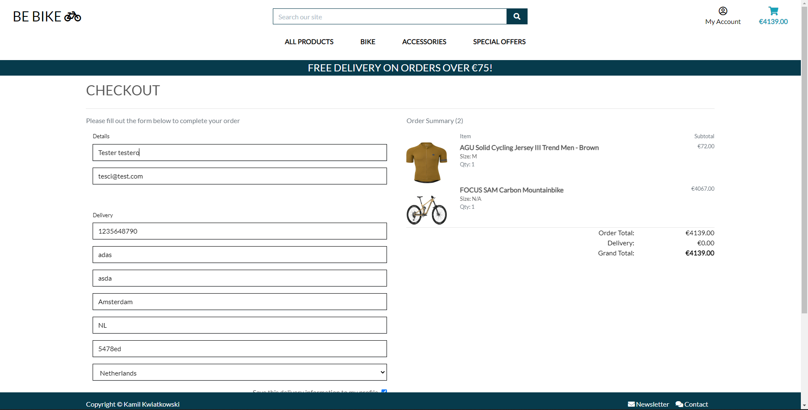
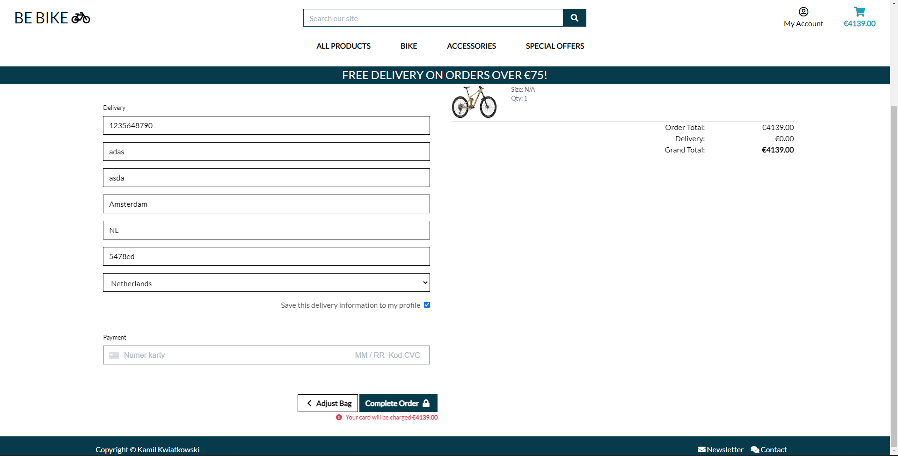

### **Checkout page success***

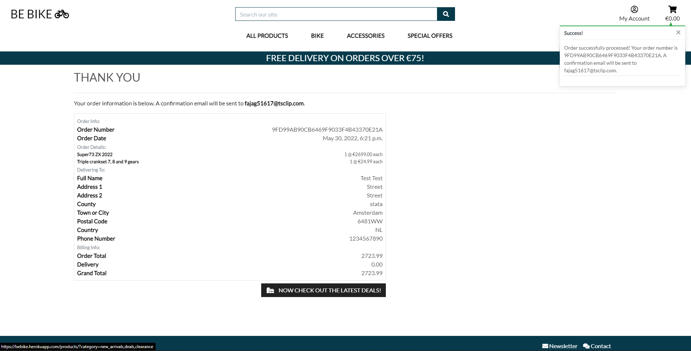

<hr>

<a name="knownBugs"></a>

# **12. Known Bugs**

<a name="fixedBugs"></a>

# **12.1 Fixed bugs**

### **boto instalation**

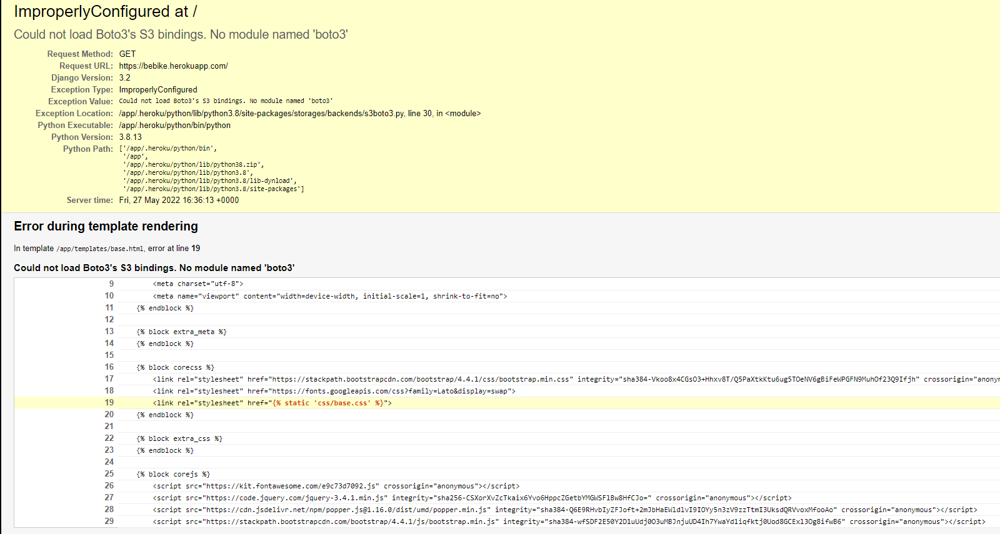

Incorrect packet unstalled instead of Boto3 boto was installed

### **product_size value error**

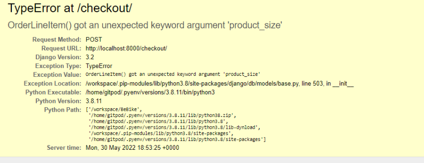


Unexpected keywors argument 'product_size' caused html 400 error once size of product was choosen, fixed by adding 'product_size' to checkout model.py

```python
    product_size = models.CharField(
                max_length=50, null=True, blank=True
    )
```

### **Incorrect calculation**

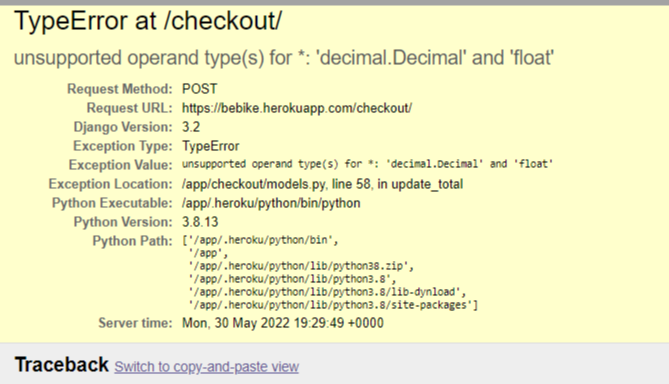

Error with calculation caused by incorrect way of assigning calculation in the checkout models

```python
        if self.order_total < settings.FREE_DELIVERY_THRESHOLD:
            self.delivery_cost = self.order_total * (
                            settings.STANDARD_DELIVERY_PERCENTAGE / 100)
```
Fixed by adding new value sdp and remove from parenthises

```python
    if self.order_total < settings.FREE_DELIVERY_THRESHOLD:
        sdp = settings.STANDARD_DELIVERY_PERCENTAGE
        self.delivery_cost = self.order_total * sdp / 100
```

### **Incorrect link in the checkout message**

Incorrect url directing to 'bag' in the secure checkout message, issue fixed by replacing it with 'checkout'

<a name="remainBugs"></a>

# **12.1 Remaining Bugs**

No remain bugs

<hr>

<a name="credits"></a>

# **14. Credits**

-   Heroku deployment instructions from Code Institute

-   Boutique Ado from code institute

-   Master Code Online with creating newsletter app and mail send

-   Stack overflow to support debugging

-   CI Tutor Support for Help with
    -   static files upload issue
    -   Incorect value in the database

-   Bootstrap documentation

-   Django documentation

-   Fontawsome

-   Bootstrap 4

-   mp4 to gif converter

-   Fine Screen recorder

-   Tutorials and inspiration

-   Images of existing products from fietsenwinkel.nl 

<a name="acknowledgements"></a>

# **14. Acknowledgements**


I want to thank my Mentor **Marcel Mulder** for support and advice during my journey in the Code Institute, I couldn't have asked for a better Mentor – Thank you, Marcel!!!

The fantastic **Code Institute Tutor Support team**, without you, I'll not be able to release this project on time

My coding Buddy **Mateusz Leks** and all colleagues and peers in the Slack Community who are always there to offer their support and advice and some general good cheer on the tougher days! 

Special thanks to my fiancé **Malgorzata Ostrowska** for all patient and believing in me when I wasn't believing in myself
