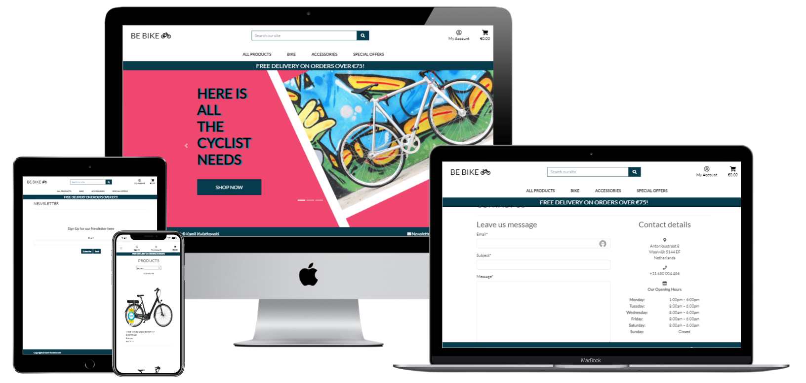

# Be Bike e-commerce store

## [See Live web](https://bebike.herokuapp.com/)

<a name="tableOfContents"></a>

# Table of Contents


[**1. Project Overview**](#overviev)
* [**1.1. Project Description**](#description)
* [**1.2 Project Requirements**](#requirements)
    * [**1.2.1 Main Technologies**](#maintech)
    * [**1.2.2 Mandatory Requirements**](#mandatory)

<hr>

[**2. UX**](#ux)
* [**2.1. Strategy**](#strategy)
    * [**2.1.1 Project Goals**](#projectGoals)
    * [**2.1.2 User Goals**](#userGoals)
    * [**2.1.3 User Expectations**](#userExpectations)
    * [**2.1.4 Trends of Modern Websites**](#trends)
* [**2.2. Structure**](#structure)
* [**2.3. Skeleton**](#skeleton)
* [**2.4. Color Scheme**](#colorScheme)
* [**2.4. Typography**](#colorScheme)
* [**2.5. Icons**](#icons)
* [**2.5. Data Base**](#dataBase)

<hr>

[**3. Agile Methodology**](#agile)
* [**3.1. KANBAN**](#kanban)

<hr>

[**4. Existing Features**](#features)
* [**4.1. Home page**](#home)
* [**4.2. Navbar**](#navbar)
* [**4.3. Footer**](#footer)
* [**4.4. The carousel**](#carousel)
* [**4.5. User authentication**](#authentication)
* [**4.6. User profile**](#userProflie)
* [**4.7. Contact**](#contact)
* [**4.8. Newsletter**](#newsletter)
* [**4.9. Shop**](#shop)
* [**4.10. Shopping bag**](#bag)
* [**4.11. Product view**](#view)
* [**4.12. Login Page**](#loginPage)
* [**4.13. Logout Page**](#logoutPage)
* [**4.14. Checkout Page**](#checkputPage)
* [**4.15. Checkout Success Page**](#successCheckputPage)
* [**4.16. Newsletter Subscribe Page**](#subscribePage)
* [**4.17. Newsletter Subscribe Pag**](#unsubscribePage)

<hr>

[**5. Technologies Used**](#technologies)
* [**5.1. Languages Used**](#languages)
* [**5.2. Frameworks Libraries**](#frameworks)
* [**5.3. Technologies and Programs Used:**](#techPrograms)

<hr>

[**6. Testing**](#testing)
* [**6.1 Python - PEP8**](#pep)
* [**6.2 Html - W3C**](#wc3html)
* [**6.3 CSS - W3C**](#wc3css)
* [**6.4 JSHint**](#jshint)
* [**6.5 Manual Testing**](#manualTesting)
* [**6.6 Function tests**](#functionTest)

<hr>

[**7. Search Engine Optimalisation**](#development)

<hr>

[**8. Marketing**](#marketing)

<hr>

[**9. Development Cycle**](#development)

<hr>

[**10. Social Media Business Page**](#development)

<hr>

[**11. Deployment**](#deployment)

<hr>

[**12. End Product**](#endProduct)

<hr>

[**13. Known Bugs**](#knownBugs)
* [**13.1 Fixed bugs**](#fixedBugs)
* [**13.1 Remaining Bugs**](#remainBugs)

<hr>

[**14. Credits**](#credits)

[Back to Table Of Content](#tableOfContents)

<a name="overviev"></a>

# **1. Project Overview**

<a name="description"></a>

# **1.1. Project Description**

One of the best benefits of living in the Netherlands is having access to over 37 000 km of bicycle paths, the only thing you need to enjoy is a bike. Therefore I have created a bike shop website, where viewers can buy a bike, as well as some basic parts and accessories.

The website allows users to use a search engine to find the most suitable product and with just one click add to the shopping trolley. The website is intuitive with a simple design, so with this e-commerce website buying a bike is as simple as ordering food delivery and who doesn’t like good home delivery. 


(#requirements)

# **1.2 Project Requirements**


PUT HERE WHAT WAS EXPECTED FROM THE PROJECT

    * [**1.2.1 Main Technologies**](#maintech)

    * [**1.2.2 Mandatory Requirements**](#mandatory)


<a name="ux"></a>

# **2. UX**

Be Bike website is designed in modern coloristic with white background. The coloristic gamma used was #EF476F #118AB2 #073B4C

Use can either choose from the dropdown menu the product category and scroll through the range of products or can use the search engine to find a specific item. 

To make a purchase users can pay with a credit card as the checkout page features stripe pay-ments.

User can also be engaged by reviewing the products. 

(#projectGoals)

# **2.1.1 Project Goals**

My goal was to create a simple and intuitive store, where customers can purchase bikes and bike related items. Website has a simple design, allowing user to navigate easily through it, by doing that customers can focus on the content, rather than trying to find items on the page.

# **2.1.2 User Goals**

(#userGoals)

ITEM            | FIRST TIME USER                  | RETURNING USER
--------------- | -------------------------------- | ---------------
View a list of products and select items to purchase | ✅ | ✅	 	 
Choose Product  Category to view products and select items to purchase | ✅ | ✅ 
Search products by name via the toolbar search option | ✅ | ✅
Have visibility on price and product details | ✅ | ✅
See the total of my purchases at the time | ✅ | ✅
Sort list of products by best rated and price | ✅ | ✅ 
Sort list of products in the specific product category | ✅ | ✅
Add items to the basket and view what is currently in the basket | ✅ | ✅
Update the quantity or remove the items from the basket before checking out | ✅ | ✅	 	 
Easily enter the payment information at the checkout page | ✅ | ✅
Have a secure payment checkout | ✅ | ✅
Check out as guest | ✅ | ✅
Create an account | ✅ | ✅
Update my user profile |  | ✅ 
View order history |  | ✅
Easily log in and log out |  | ✅
Register for an account |  | ✅


# **2.1.3 User Expectations** (#userExpectations)

The website should have a simple user interface, with the navigation to each section clear
-	The menu is intuitive and clear to read.

-	The user can navigate easily through an interface. 

-	The website responsiveness is achieved on all devices. 

-	The user has a clear overview of all products/product groups. 

-	Before making a payment the total purchase price is displayed, and product quantities can be removed/ adjusted. 

-	Website has a secure payment method, giving the user comfort feeling


# **2.1.4 Trends of Modern Websites** (#trends)

Based on the new trends in the website design, I have used the concept from the 1980s – Memphis design, which in this case was making the main page design simultaneously more color, approachable and adventurous.  


# **2.2. Structure** (#structure)

Responsiveness design has been included in this project, as users are using different devices (including mobiles, laptops/ PC, and tablets). This is to ensure user achieves the best experiences on their chosen device.

-	User can easily navigate through labeled buttons 

-	All elements are consistent in font size, and color scheme. 


# **2.3. Skeleton** (#skeleton)

## **Wireframes**

### **Home page**
<hr>

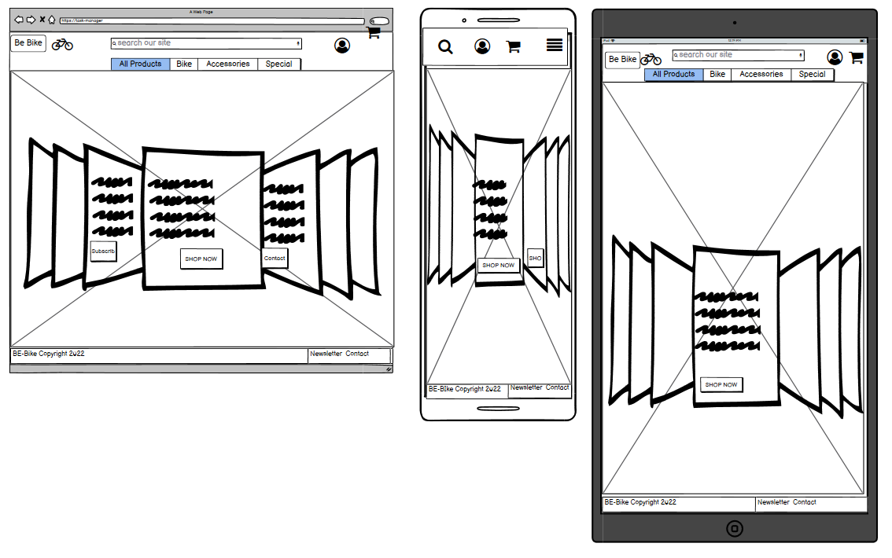

### **Sign up page**
<hr>

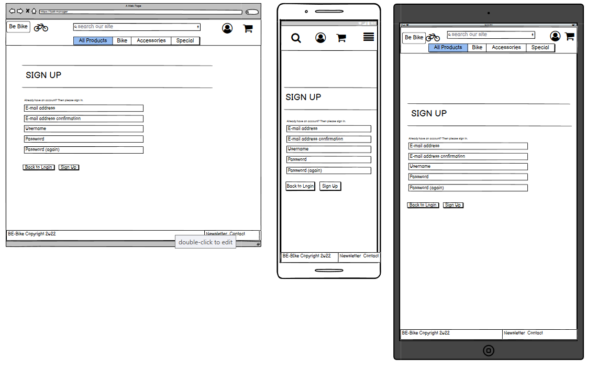

### **Sign in page**
<hr>

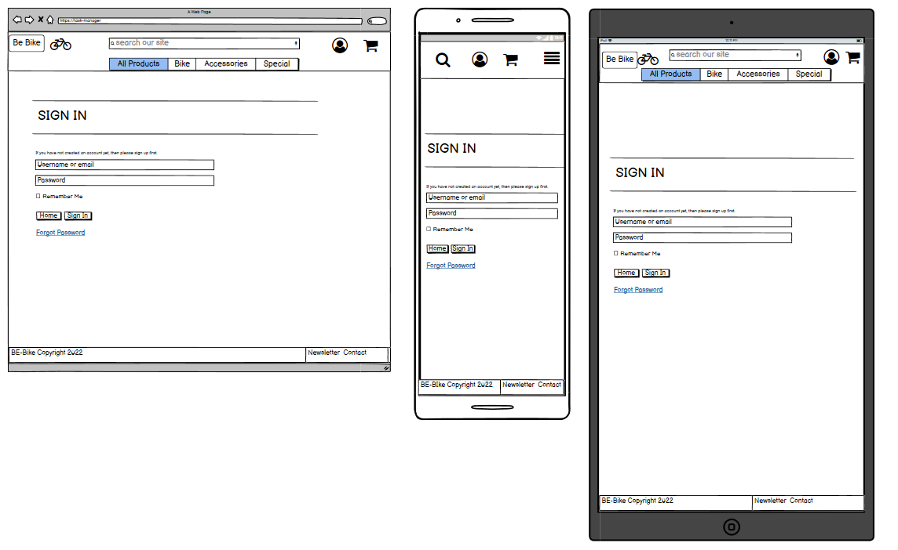


### **Contact page**
<hr>

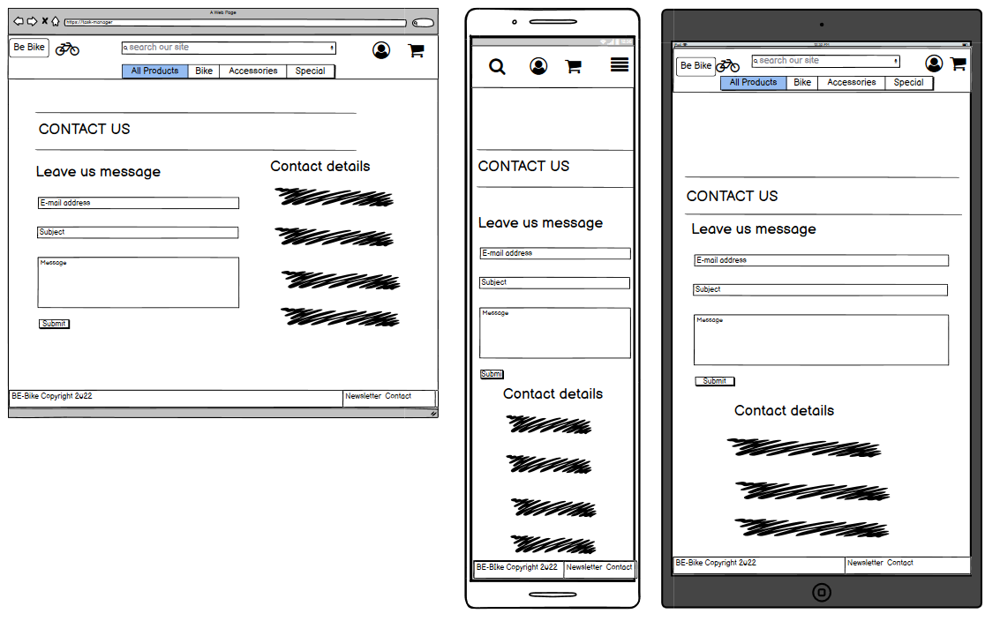

### **Newsletter**
<hr>

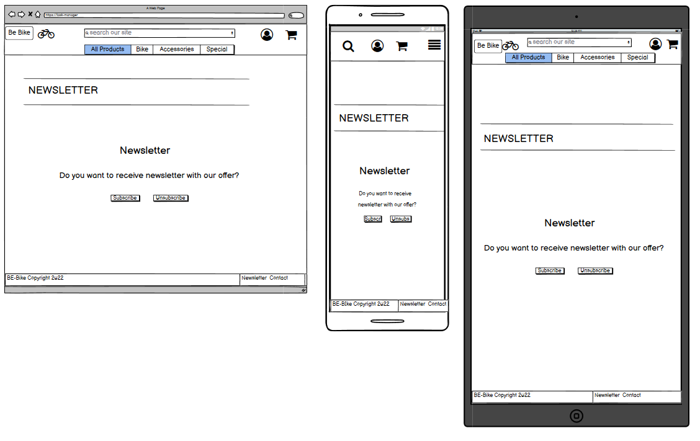

### **Newsletter Subscribe**
<hr>

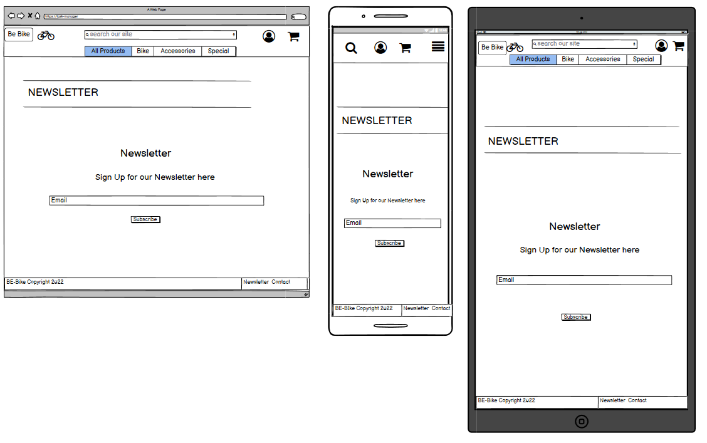
<hr>

### **Newsletter Unsubscribe**

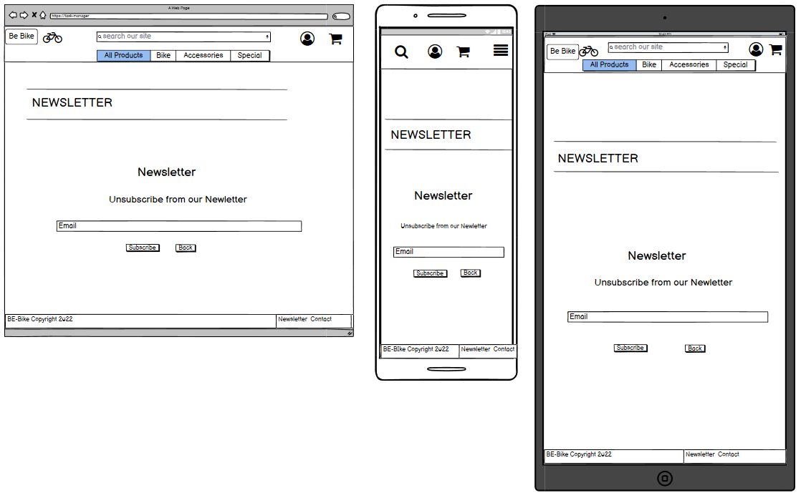
<hr>

### **Products**

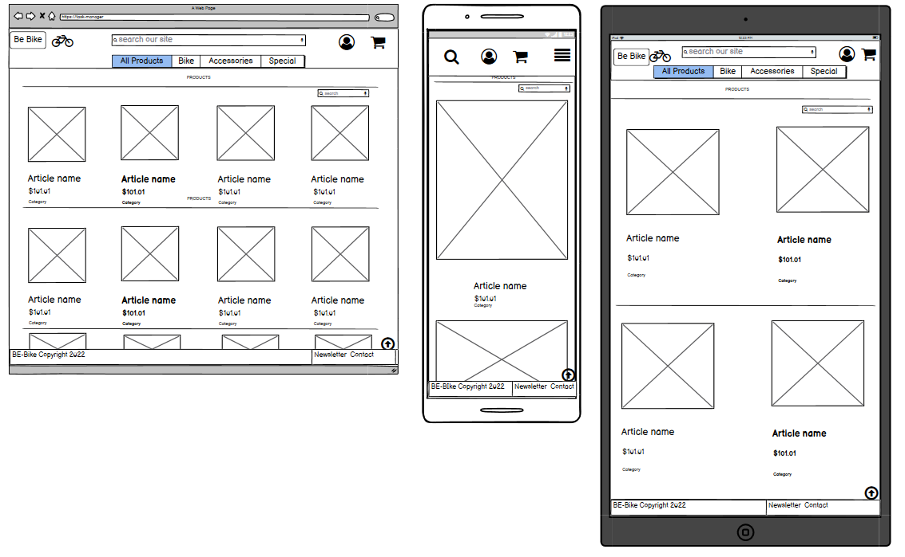
<hr>

### **Products View**

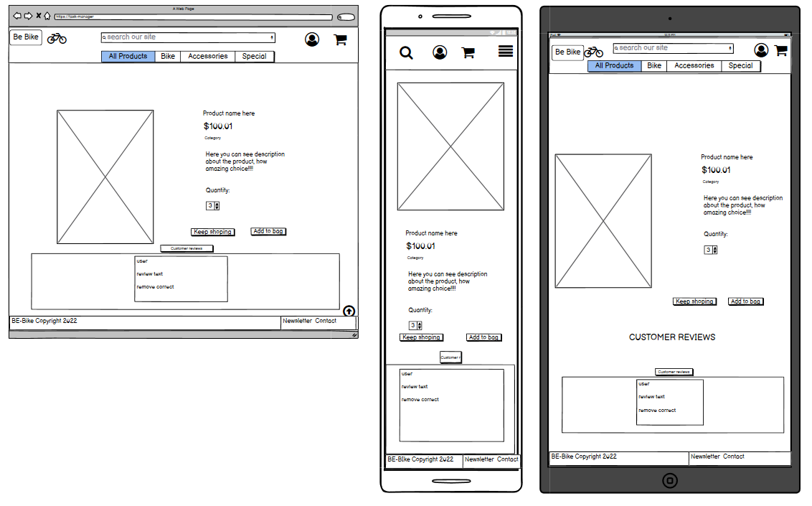
<hr>

### **Shopping bag**

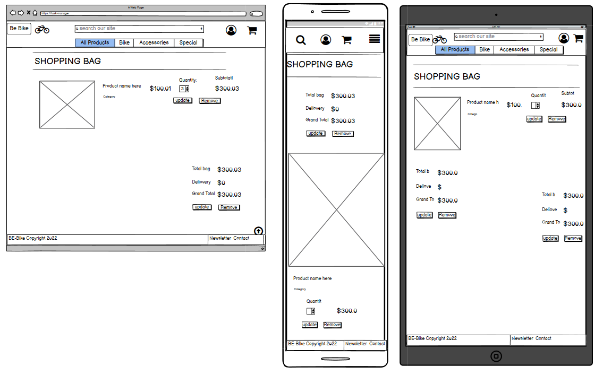
<hr>


# **2.4. Color Scheme** (#colorScheme)

Colors

Please find the colours schemes that I used colors #EF476F #118AB2 #073B4C

### **Color gamma**

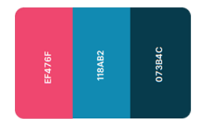
<hr>


# **2.5. Typography** (#typography)

I decided to use Lato as my font of choice with sans serif as my backup font for browsers that might not support Lato.

The link to the font can be found [Google Fonts](https://fonts.google.com/)

# **2.6. Icons** (#icons)

I use icons provided by [Font Awesome](https://fontawesome.com/)

My account fa-user-circle-o
### **My account - fa-user-circle-o**


<hr>

### **Bag shopping-cart**

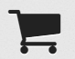
<hr>

### **Newsletter fa-envelope**

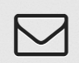
<hr>

### **Contact fa-comments-o**


<hr>

# **2.6. Database** (#dataBase)

### **Checkout model structure:**

```python
class Order(models.Model):
    order_number = models.CharField(max_length=32, null=False, editable=False)
    user_profile = models.ForeignKey(UserProfile, on_delete=models.SET_NULL,
                                     null=True, blank=True, related_name='orders')
    full_name = models.CharField(max_length=50, null=False, blank=False)
    email = models.EmailField(max_length=254, null=False, blank=False)
    phone_number = models.CharField(max_length=20, null=False, blank=False)
    country = CountryField(blank_label='Country *', null=False, blank=False)
    postcode = models.CharField(max_length=20, null=True, blank=True)
    town_or_city = models.CharField(max_length=40, null=False, blank=False)
    street_address1 = models.CharField(max_length=80, null=False, blank=False)
    street_address2 = models.CharField(max_length=80, null=True, blank=True)
    county = models.CharField(max_length=80, null=True, blank=True)
    date = models.DateTimeField(auto_now_add=True)
    delivery_cost = models.DecimalField(max_digits=6, decimal_places=2, null=False, default=0)
    order_total = models.DecimalField(max_digits=10, decimal_places=2, null=False, default=0)
    grand_total = models.DecimalField(max_digits=10, decimal_places=2, null=False, default=0)
    original_bag = models.TextField(null=False, blank=False, default='')
    stripe_pid = models.CharField(max_length=254, null=False, blank=False, default='')

    def _generate_order_number(self):
        """
        Generate a random, unique order number using UUID
        """
        return uuid.uuid4().hex.upper()

    def update_total(self):
        """
        Update grand total each time a line item is added,
        accounting for delivery costs.
        """
        self.order_total = self.lineitems.aggregate(Sum('lineitem_total'))['lineitem_total__sum'] or 0
        if self.order_total < settings.FREE_DELIVERY_THRESHOLD:
            self.delivery_cost = self.order_total * settings.STANDARD_DELIVERY_PERCENTAGE / 100
        else:
            self.delivery_cost = 0
        self.grand_total = self.order_total + self.delivery_cost
        self.save()

    def save(self, *args, **kwargs):
        """
        Override the original save method to set the order number
        if it hasn't been set already.
        """
        if not self.order_number:
            self.order_number = self._generate_order_number()
        super().save(*args, **kwargs)

    def __str__(self):
        return self.order_number


class OrderLineItem(models.Model):
    order = models.ForeignKey(Order, null=False, blank=False, on_delete=models.CASCADE, related_name='lineitems')
    product = models.ForeignKey(Product, null=False, blank=False, on_delete=models.CASCADE)
    product_size = models.CharField(max_length=2, null=True, blank=True) # XS, S, M, L, XL
    quantity = models.IntegerField(null=False, blank=False, default=0)
    lineitem_total = models.DecimalField(max_digits=6, decimal_places=2, null=False, blank=False, editable=False)

    def save(self, *args, **kwargs):
        """
        Override the original save method to set the lineitem total
        and update the order total.
        """
        self.lineitem_total = self.product.price * self.quantity
        super().save(*args, **kwargs)

    def __str__(self):
        return f'SKU {self.product.sku} on order {self.order.order_number}'
```
### **Contact model structure:**

```python
class Contact(models.Model):
    email = models.EmailField()
    subject = models.CharField(max_length=255)
    message = models.TextField()

    def __str__(self):
        return self.email
```

### **Newsletter model structure:**

```python
class NewsletterUser(models.Model):
    email = models.EmailField()
    date_added = models.DateTimeField(auto_now=True)

    def __str__(self):
        return self.email
```
### **Products model structure:**

```python
class Category(models.Model):

    class Meta:
        verbose_name_plural = 'Categories'
        
    name = models.CharField(max_length=254)
    friendly_name = models.CharField(max_length=254, null=True, blank=True)

    def __str__(self):
        return self.name

    def get_friendly_name(self):
        return self.friendly_name


class Product(models.Model):
    category = models.ForeignKey('Category', null=True, blank=True, on_delete=models.SET_NULL)
    sku = models.CharField(max_length=254, null=True, blank=True)
    name = models.CharField(max_length=254)
    description = models.TextField()
    has_sizes = models.BooleanField(default=False, null=True, blank=True)
    price = models.DecimalField(max_digits=7, decimal_places=2)
    rating = models.DecimalField(max_digits=6, decimal_places=2, null=True, blank=True)
    image_url = models.URLField(max_length=1024, null=True, blank=True)
    image = models.ImageField(null=True, blank=True)

    def __str__(self):
        return self.name
```
### **Profile model structure:**

```python
class UserProfile(models.Model):
    """
    A user profile model for maintaining default
    delivery information and order history
    """
    user = models.OneToOneField(User, on_delete=models.CASCADE)
    default_phone_number = models.CharField(max_length=20, null=True, blank=True)
    default_street_address1 = models.CharField(max_length=80, null=True, blank=True)
    default_street_address2 = models.CharField(max_length=80, null=True, blank=True)
    default_town_or_city = models.CharField(max_length=40, null=True, blank=True)
    default_county = models.CharField(max_length=80, null=True, blank=True)
    default_postcode = models.CharField(max_length=20, null=True, blank=True)
    default_country = CountryField(blank_label='Country', null=True, blank=True)

    def __str__(self):
        return self.user.username


@receiver(post_save, sender=User)
def create_or_update_user_profile(sender, instance, created, **kwargs):
    """
    Create or update the user profile
    """
    if created:
        UserProfile.objects.create(user=instance)
    # Existing users: just save the profile
    instance.userprofile.save()
```

### **Reviews model structure:**

```python
class Review(models.Model):
    """[Review model]"""
    user = models.ForeignKey(UserProfile, on_delete=models.CASCADE)
    product = models.ForeignKey(Product, on_delete=models.CASCADE)
    description = models.TextField(max_length=500, null=False,
                                   blank=False)
    review_date = models.DateTimeField(auto_now_add=True)
```

[Back to Table Of Content](#tableOfContents)


# **3. Agile Methodology** (#agile)

Github issues were used to create the User stories and group them according to the MoSCoW pri-oritization technique. Link to the project with live issues can be found [here](https://github.com/kamil-kw/BeBike/projects/1)

The issues were then closed automatically when the pull request was linked to the issue.


# **3.1. KANBAN** (#kanban)

### **Kanban Initial**
<hr>

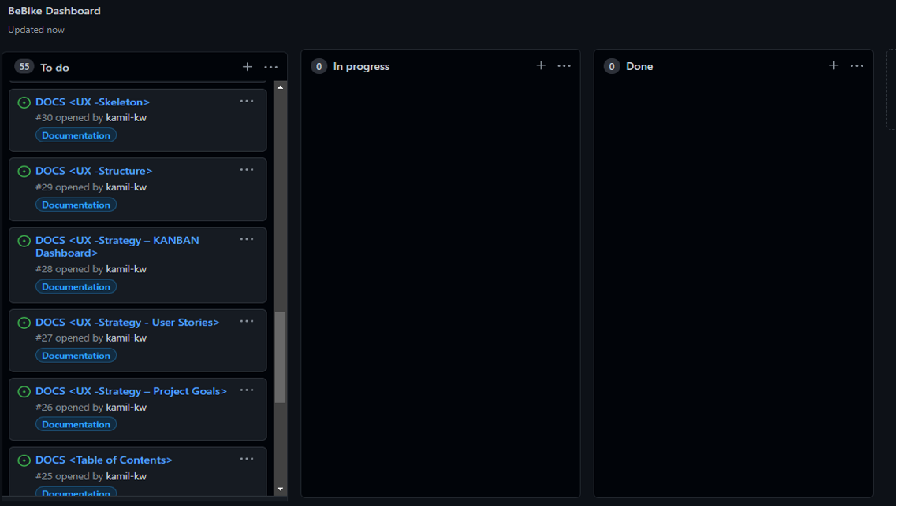

### **Kanban Mid process**
<hr>


### **Kanban Mid process**
<hr>


ADD CANBAN BOARDS


[Back to Table Of Content](#tableOfContents)

# **4. Existing Features** (#features)

-	Responsive design

-	Navigation Menu

-	Postgress databases to store information and user login/profile information

-	CRUD Functionality

-	Filter list details functionality

-	Login functionality

-	Logout functionality

-	Register functionality

# **4.1. Home page** (#home)

-	A carousel that displays contact newsletter and shop now options.

-	A shop now button that directs the user to the all products page where user can easily
identify products they would like to purchase.

-	A contact button that directs the user to the contact form where user can then 
contact with store team

# **4.2. Navbar**(#navbar)

-	Store name with link to home page.

-	Search products bar.

-	My Account dropdown list with user autentication, display content accordingly

-	Product categories displayed to easy reach of content, changing to small icon once viewed on the small screen

# **4.3. Footer**(#footer)

-	Copy rights.

-	Contact link to access page where user can contact with store crew.

-	Newsletter link to access page where user can subscribe or unsubscribe to recive special offer


# **4.4. The carousel**(#carousel)

-	A carousel that displays contact newsletter and shop now options.

-	Shop now slide with message and button to product page

-	Contact slide with message and button to contact page

-	Newsletter slide with message and button to newsletter page

# **4.5. User authentication** (#authentication)

-	If user new than can register using register option in the My account

-	If user is registered than can login using My account link

# **4.6. User profile** (#userProflie)

-	This page shows a form so the user can update their delivery details. Upon completing the form, all delivery details will be updated if the user proceeds to the checkout page again.

-	Order history is also displayed, where the user can select the order number to view a previous order confirmation summary. An alert will also show prompting the user they are viewing a past order confirmation summary.

# **4.7. Contact** (#contact)

-	Where user can leave message to store crew using site form

-	Form check if email include @ sign, to ensure store crew are able to return to user

-	Contact details - if user want to visit store or use diferent form of contact

# **4.8. Newsletter** (#newsletter)

-	User can choose subscribe or unsubscribe, this will direct to correct page to newsletter

# **4.9. Shop**(#shop)

-	The user can access the product pages by selecting the product category from the navigation bar.

-	 Filter using sort bar at the top right of the page,  user can filter by price, rating, name and category.

-	Each product has an image, name of product, price, category and rating.

-	The page also contains a back to top button, which the user can click to go to the top of the page.

-	As a superuser, the admin can see the edit and delete buttons, allowing quick access to the product admin


# **4.10. Shopping bag**(#bag)

-	This page shows each product as a line item, displaying an image, name of the product, weight, SKU, price per item, the quantity selected, quantity selector to update and a subtotal for each item.

-	When the quantity selector is at 1, the minus button is disabled.

-	A pricing summary of the whole basket is also shown with the basket total, delivery fee and total.

-	If the user has not met the free delivery threshold then an alert message is shown, prompting the user that they can qualify for free delivery if they spend more.

# **4.11. Product view**(#view)

-	The product details will showcase an image, name of the product, short description, price, weight selector(if the product has different weights), category and rating, quantity selector, keep shopping button and an add to basket button.

-	As a superuser, the admin can see the edit and delete buttons, allowing quick access to the product admin.

-	The quantity selector starts at 1. When the quantity is at 1, the minus button is disabled.

-	When adding a product to the basket, the user will be prompted with a success message confirming the product has been added.


# **4.12. Login Page**(#loginPage)

-	A login form that requires the user to enter the email address and password that they used when signing up to the site.

-	The user can only log in once they have activated their account via an email received after signing up.

-	A message to prompt the user that if an account has not been created they can click the signup hyperlink to be redirected to the signup page.

-	If the user enters in the wrong credentials, a message is displayed to the user.

-	Once the user has successfully logged in, they will be redirected to the home page. A success message will show to confirm the login has been successful.


# **4.13. Logout Page**(#logoutPage)

-	When clicking logout from the navigation bar, the user is redirected to a sign-out page to confirm their action.

# **4.14. Checkout Page**(#checkputPage)
-	A checkout form, prompts the user to enter their delivery details with Stripe integration.

-	A checkbox for the user to confirm if they would like to save their details for next time. This only saves delivery details and not the card details.

-	A summary of the user's order is also shown, the user can then be sure they are making the correct purchase before continuing with the checkout process.

-	A message is shown just below the complete order button to warn the user that they will be charged a certain amount on their card.

# **4.15. Checkout Success Page**(#successCheckputPage)

-	This page shows a summary of their order, with an order number.

-	Once the user is on this page, an email will also be triggered to send out an order confirmation email.

# **4.16. Newsletter Subscribe Page**(#subscribePage)

-	A one-field form for the user to enter their email to subscribe to the newsletter.

-	Once the user has successfully subscribed to the newsletter, they will be redirected to the home page. A success message will show up confirming the user has successfully subscribed to the newsletter.

-	If the user has already subscribed, an error message will show up.

# **4.17. Newsletter Subscribe Page**(#unsubscribePage)

-	A one-field form for the user to enter their email to unsubscribe from the newsletter.

-   Once the user has successfully unsubscribed from the newsletter, they will be redirected to the home page. A success message will show up confirming the user has successfully unsubscribed to the newsletter.

-   If the user enters an email address that is not subscribed to the newsletter, a message will be displayed to the user.


# **5. Technologies Used** (#technologies)

# **5.1. Languages Used** (#languages)

-   [HTML5](https://en.wikipedia.org/wiki/HTML)
    -   The project uses HyperText Markup Language.
-   [CSS3](https://en.wikipedia.org/wiki/CSS)
    -   The project uses Cascading Style Sheets.
-   [JavaScript](https://en.wikipedia.org/wiki/JavaScript)
    -   The project uses JavaScript.
-   [Python](https://en.wikipedia.org/wiki/Python_(programming_language))
    -   The project uses Python.
    -   asgiref==3.5.1
    -   backports.zoneinfo==0.2.1
    -   boto3==1.23.9
    -   botocore==1.26.9
    -   dj-database-url==0.5.0
    -   Django==3.2
    -   django-allauth==0.41.0
    -   django-countries==7.2.1
    -   django-crispy-forms==1.14.0
    -   django-formtools==2.3
    -   django-storages==1.12.3
    -   gunicorn==20.1.0
    -   jmespath==1.0.0
    -   oauthlib==3.2.0
    -   Pillow==9.1.0
    -   psycopg2-binary==2.9.3
    -   python3-openid==3.2.0
    -   pytz==2022.1
    -   requests-oauthlib==1.3.1
    -   s3transfer==0.5.2
    -   sqlparse==0.4.2
    -   stripe==2.72.0

# **5.2. Frameworks Libraries** (#frameworks)
-   [Django](https://www.djangoproject.com/)
    -   The project uses Django as the main framework.
-   [Boostrap 4](https://getbootstrap.com/docs/4.0/getting-started/introduction/)

# **5.3. Frameworks Libraries** (#frameworks)

-   [Sqlite](https://www.sqlite.org/index.html)
    -   The project uses sqlite as a local enviromental database
-   [PostgreSQL](https://www.postgresql.org/)
    -   The project uses PostgreSQL as a deployment database


# **5.4. Technologies and Programs Used:** (#techPrograms)

-   [AWS](https://aws.amazon.com/)
    -   The project uses Amazon Web Services to host all static and media files.
-   [Heroku](https://www.heroku.com/)
    -   The project is deployed and hosted by Heroku.
-   [Balsamiq](https://balsamiq.com/)
    -   Balsamiq was used to create the wireframes during the design process.
-   [Google Fonts](https://fonts.google.com/)
    -   Google fonts were used to import the "Be Vietnam Pro" font into the style.css file which is used on all pages throughout the project.
-   [GitHub](https://github.com/)
    -   GitHub was used to store the project's code after being pushed from Git
-   [Gitpod](https://www.gitpod.io/)
    -   The project uses Gitpod.
-   [Chrome](https://www.google.com/intl/en_uk/chrome/)
    -   The project uses Chrome to debug and test the source code using HTML5.
-   [W3School](https://www.w3schools.com/)
    - For problem solving and code searching
-   [Stack Overflow](https://stackoverflow.com/)
    - For problem solving and code searching
-   [PEP8 validator](http://pep8online.com/)
    - For checking python convention
-   [Font Awesome](https://fontawesome.com/)
    - Special Icons for links
-   [Multi Device Website Mockup Generator](https://techsini.com/multi-mockup/index.php)
    - Multi Device Website Mockup Generator was used to create the Mock up image in this README


# **6. Testing** (#testing)

# **6.1 Python - PEP8** (#pep)

Issues with missig dockstring, too long lines are fixed using pylint builded in the gitpod therefore no issues left for PEP8

# **6.2 Html - W3C** (#wc3html)

Code pass W3C HTML without errors

# **6.3 CSS - W3C** (#wc3css)

Code pass W3C CSS without errors

# **6.4 JSHint** (#jshint)

Code pass JShint without errors

# **6.5 Manual Testing** (#manualTesting)

# **6.6 Function tests** (#functionTest)

<hr>

# **7. Search Engine Optimalisation**](#development)
To improve the search engine optimisation (SEO) of the site I:

- Added keywords in a meta tag to my base.html. The keywords were researched using [WordTracker](https://www.wordtracker.com/), there are a number of short-tail and long-tail keywords for teritory of Netherlands.

- This is a list of all the keywords I came up with,
    - short tail words - bike, bicicle, ebike,city bike
    - long tail words - bike shop near me, electric bike, mountain bike, transport bike

- I ended up using these:

Word Bike

Key Word             | Average search over last 12 months                  | Organic competition    | In Anchor And Title |
-------------------- | --------------------------------------------------- | ---------------------- | ------------------- |
bike shop near me | 49,200 | 28.74 | 5 |
bike shop | 24,908 | 24.03 | 3,999 |
mountain bike | 15.842 | 35.54 | 24.247 |
bike | 11.842 | 64.11 | 366.562 |
bicycling | 9,817 | 26.01 | 79,118 |
bike | 180,575 | 64.11 | 5,759 |
e bike | 119,640 | 35.98 | 25,638 |
bicycle shop | 92,625 | 16.8 | 768 |
electric bicycle | 70,083 | 20.87 | 2,086 |
cycle | 42,750 | 70.77 | 577.838 |
e bikes for sale | 23,850 | 6.54 | 10 |
  |  |  |  |
  |  |  |  |
  |  |  |  |
  |  |  |  |
  |  |  |  |
  |  |  |  |
  |  |  |  |


I chose these keywords because they didn't have incredibly high volume and competition.
<hr>

# **8. Marketing**](#marketing)

For my marketing strategies, I decided to go with content marketing, Social media and email marketing root. As these are free options and very effective for an E-commerce store.

- Social media - Using these platforms will help build and interact with customers to build relationships and loyalty. This also helps build the brand. Followers will help share the business posts and in result gain more traction with other people. The same content can be across all social media platforms.

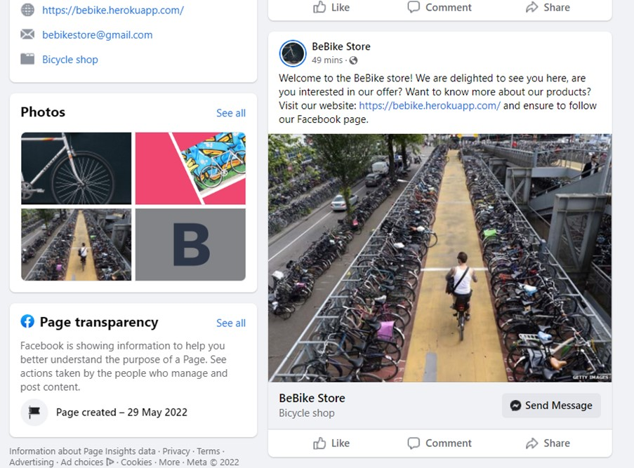


- Email marketing - Using email marking via a newsletter will be beneficial as it is a free source of marketing. Those who are subscribed are more likely to convert into paying customers. This will increase sales and returning customers as I can provide discount codes and other special offers. A good pro is that the business has total control over the design of the emails.
<hr>

# **9. Social Media Business Page**](#development)

The business will use social media as a platform to promote the business is [facebook business page](https://www.facebook.com/BeBike-Store-100847359323133)


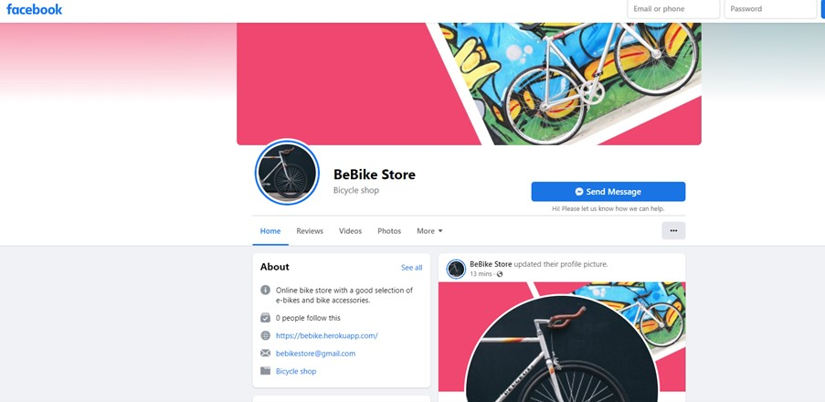

<hr>

# **10. Development Cycle**](#development)

# **11. Deployment**](#deployment)
### **Development Environment**
<hr>

1. Create requirements.txt pip3 freeze --local > requirements.txt
2. Create Procfile.
3. Commit and push changes to Github.
4. Move to the Heroku part of a deployment.

### **To deploy my final project to the cloud I used Heroku. To do this I had to**
<hr>

1. Push the latest code to GitHub.
2. Go to Heroku
3. Select new in the top right corner.
4. Create a new app.
5. Enter the app name and select Europe as the region.
6. Connect to GitHub.
7. Search for repo-name.
8. Select connect to the relevant repo you want to deploy.
9. Select the settings tab.
10. Add buildpack
11. Select Python, then save changes.
12. Make sure Heroku/Python is at the top of the list, followed by Heroku/Nodejs
13. Navigate to the deploy tab
14. Scroll down to Manual Deploy and select deploy branch.

### **AWS S3 Bucket Configuration**
1. Add and configure the AWS S3 Bucket:bebike, All public access. ACL: Everyone Objects -> List.
2. Create the Bucket Policy - bebike policy.
3. Create the Cross-Origin Resource Sharing (CORS)
4. Access AWS IAM and create a user for the Training Project. Create a group, with the user attached. Download the CSV file with the credentials and save it in a safe place. Updated the ‘.env’ file with the relevant variables.
5. Execute python3 manage.py collectstatic to upload static files to the AWS S3 Bucket.
6. Upload the ‘media’ folder and files manually.
7. Remove DISABLE_COLLECTSTATIC variable from Heroku Config Vars.

### **Heroku Postgres Database**
<hr>

1. Go to the Resources tab in Heroku.
2. Select Heroku Postgres from the Add-ons search bar
3. Choose the Hobby Dev-Free plan.
4. Click submit the order form.
5. Go back to Gitpod bash terminal and install
    * pip3 install dj_databse_url
    * pip3 install psycopg2-binary 
6. Seve in the requirements file by: 
    * pip3 freeze > requirements.txt
<hr>

# **12. End Product**](#endProduct)

<hr>

# **13. Known Bugs**](#knownBugs)
# ***13.1 Fixed bugs**](#fixedBugs)
# **13.1 Remaining Bugs**](#remainBugs)

<hr>

# **14. Credits**](#credits)


------------------------------------------------------------------------------------------------------------------------------------------------------------------------------------------------------------------------------------------------------------------------------------------------------------------------------------------------------
------------------------------------------------------------------------------------------------------------------------------------------------------------------------------------------------------------------------------------------------------------------------------------------------------------------------------------------------------
------------------------------------------------------------------------------------------------------------------------------------------------------------------------------------------------------------------------------------------------------------------------------------------------------------------------------------------------------
------------------------------------------------------------------------------------------------------------------------------------------------------------------------------------------------------------------------------------------------------------------------------------------------------------------------------------------------------
# **1.3. Skeleton**

### **Diagram**

# **1.5. Database Design**

### **Security**
<hr>


# **2. Features**


### **Importance and Difficulty table**
<hr>


# **4. Testing**

<a name="pep"></a>

## **4.1 Validators**

### **PEP8**

Code pass PEP8 without critical errors

### **W3C HTML**

Code pass W3C HTML without errors

### **W3C CSS**

Code pass W3C CSS without errors


[Back to Table Of Content](#tableOfContents)

<a name="manualTesting"></a>


