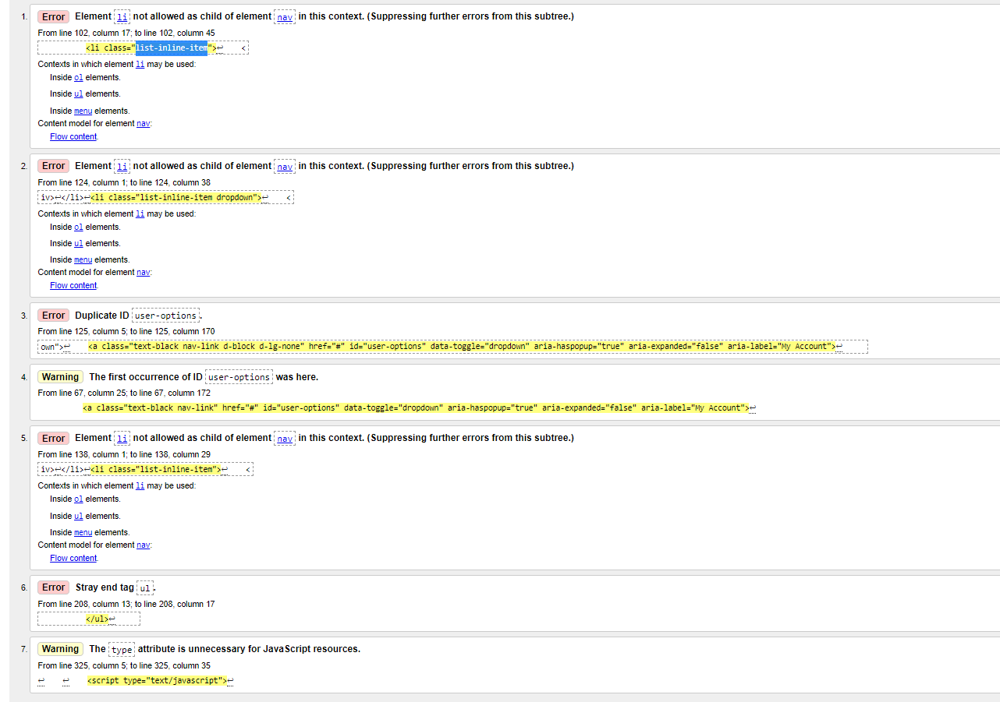
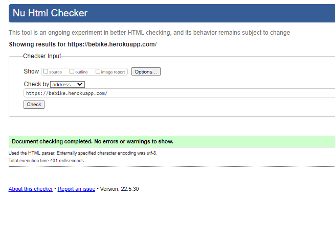
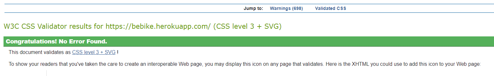
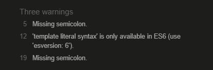
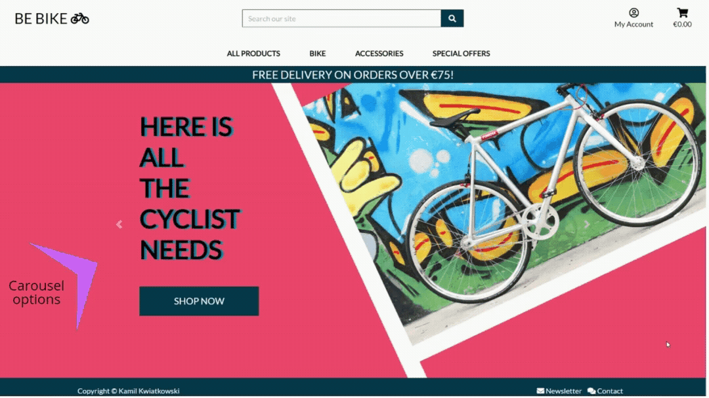
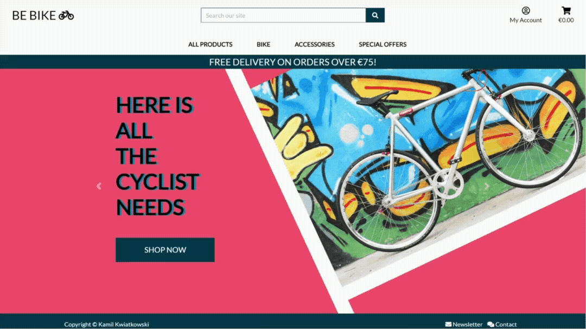
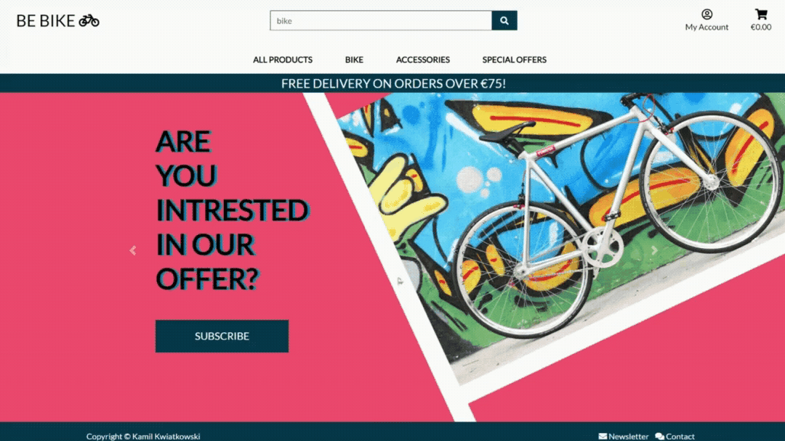

# Testing

[**6. Testing**](#testing)
* [**6.1 Python - PEP8**](#pep)
* [**6.2 Html - W3C**](#wc3html)
* [**6.3 CSS - W3C**](#wc3css)
* [**6.4 JSHint**](#jshint)
* [**6.5 Manual Testing**](#manualTesting)
    * [**6.5.1 Home page**](#homeTest)
        *   Carousel
        *   Buttons caurusel
        *   Navbar
        *   Footer
        *   Home responsivenes
    * [**6.5.2 My account**](#myAccountTest)
        *   My account register
        *   My account login logout user
        *   My account login admin

    * [**6.5.3 Products**](#productsTesting)
        *   Add products to database
        *   All products add to bag
        *   Add review
        *   Add product responsivnes
        *   Product view responsivnes
    * [**6.5.4 Checkout payment**](#checkoutTesting)
    * [**6.5.5 Contact Form**](#contactTesting)
    * [**6.5.6 Newsletter subscribe and unsubscribe**](#newsletterTesting)

<a name="pep"></a>

# **6.1 Python - PEP8**

-   Issues with missing docstring, too long lines are fixed using pylint built in the gitpod therefore no issues left for PEP8

<a name="wc3html"></a>

# **6.2 Html - W3C**

# **Error list W3C html**



1, 2, 5 Closed ```li``` tag in ```ul``` tag to follow good practice method

3, 4 id changed to user-options-base to remove conflict

7 The type attribute removed from each script including ```type="text/javascript"

# **Pass W3C html**



Code pass W3C HTML without errors

<a name="wc3css"></a>

# **6.3 CSS - W3C**

# **Pass W3C CSS**



Code pass W3C CSS without errors

<a name="jshint"></a>

# **6.4 JSHint**

# **bag script**



1, 2, semi colon added
3, ```/*jshint esversion: 6 */``` added to code

Other Code pass JShint without errors

<a name="manualTesting"></a>

# **6.5 Manual Testing**

<a name="homeTest"></a>

# **6.5.1 Home page**

# **Carousel**



# **Buttons caurusel**



# **Navbar**


# **Footer**



# **Home responsivenes**


<a name="myAccountTest"></a>

# **6.5.2 My account**

# **My account register**


# **My account login logout user**


# **My account login admin**


<a name="productsTesting"></a>

# **6.5.3 Products**

# **Add products to database**


# **All products add to bag**


# **Add review**


# **Add product responsivnes**


# **Product view responsivnes**


<a name="checkoutTesting"></a>

# **6.5.4 Checkout payment**


<a name="contactTesting"></a>

# **6.5.5 Contact Form**

<a name="newsletterTesting"></a>


# **6.5.6 Newsletter subscribe and unsubscribe**

